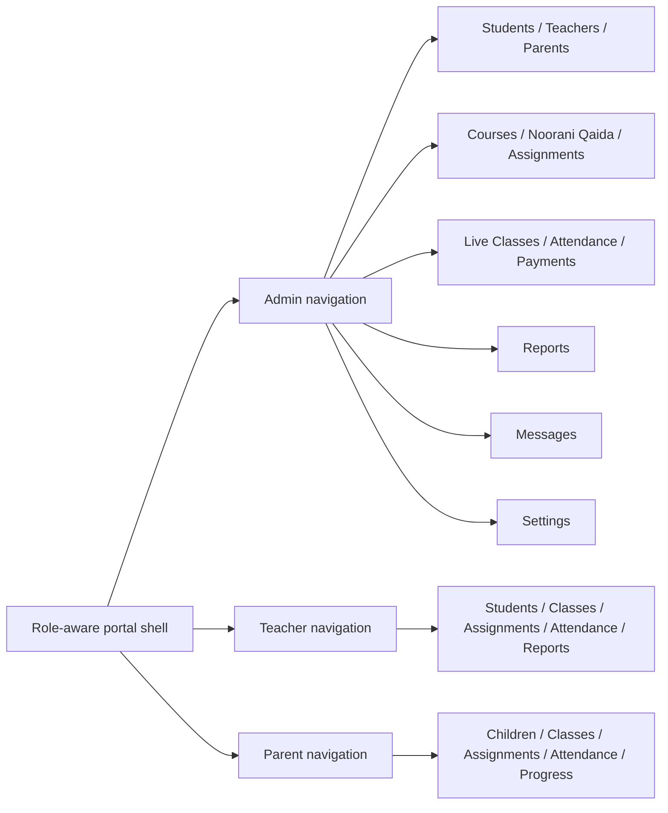

# NoorPath Enterprise Admin Restructure — Consolidation Plan

## Non-negotiable boundary

No file inside `src/features/noorani-qaida/**` will be edited. Qaida lesson, ebook, games, audio, tracing, animation, reward, mascot, progress, and learning-flow behavior remain unchanged.

## Product architecture



## Phased implementation

### Phase 0 — Safety and correctness

1. Generalize `authorizeAdmin` into role-aware authorization while preserving its public API.
2. Add server-side tutor and parent layout guards.
3. Extend middleware to protect `/tutor/**` and `/parent/**`.
4. Reconcile tutor report list fields with the report form and database type.
5. Preserve the existing auth storage key and cookie chunking.

### Phase 1 — Shared enterprise foundation

1. Introduce reusable portal UI primitives that wrap existing CSS contracts.
2. Unify Sidebar and TopBar state; remove direct DOM manipulation.
3. Add responsive 12-column grid and 8px spacing tokens.
4. Add accessible dialog, loading, empty, status, and form patterns.
5. Remove non-functional global controls rather than presenting fake features.

### Phase 2 — Zero-risk deduplication

1. Extract one shared message center and make all role routes render it.
2. Extract one shared profile/account settings component.
3. Extract common status maps, loading states, and parent child-selection state.
4. Remove only verified dead component/assets/dependency.

### Phase 3 — Admin information architecture

| Target route | Source capability | Compatibility |
|---|---|---|
| `/admin/students` | existing students | unchanged |
| `/admin/teachers` | tutor subset from users + availability | `/admin/users` retained as redirect or compatibility entry |
| `/admin/parents` | parent subset from users | new real role-filtered list |
| `/admin/courses` | existing courses | unchanged |
| `/admin/noorani-qaida` | existing Qaida mount | unchanged |
| `/admin/live-classes` | sessions | `/admin/sessions` compatibility redirect |
| `/admin/assignments` | homework templates/logs | new aggregate, real data only |
| `/admin/attendance` | attendance | new aggregate, real data only |
| `/admin/payments` | fees + earnings + reminders | legacy routes retained until migrated |
| `/admin/reports` | reports + analytics views | analytics compatibility route |
| `/admin/messages` | chat + broadcasts | notifications compatibility route |
| `/admin/settings` | organization/account/reminders | no fake API/SEO/storage controls |

### Phase 4 — Role simplification

#### Teacher

- Dashboard
- Students
- Live Classes
- Assignments
- Attendance
- Reports
- Messages
- Payments
- Settings

The voice tracker remains accessible only if explicitly retained as a utility; it is not presented as a core enterprise workflow because it does not persist results.

#### Parent

- Dashboard
- Children / Progress
- Live Classes
- Assignments
- Attendance
- Payments
- Messages
- Settings

Journey, roadmap, mushaf, and timeline content should be composed inside Progress rather than occupying separate primary navigation entries. Existing routes remain available until the consolidated hub contains all information.

## Target source structure

```text
src/
  app/
    admin/
      students/
      teachers/
      parents/
      courses/
      noorani-qaida/        # mount unchanged
      live-classes/
      assignments/
      attendance/
      payments/
      reports/
      messages/
      settings/
    tutor/
    parent/
  components/
    portal/
      PortalShell.tsx
      PortalSidebar.tsx
      PortalTopBar.tsx
    ui/
      Card.tsx
      DataTable.tsx
      Dialog.tsx
      FormField.tsx
      PageHeader.tsx
      ResponsiveGrid.tsx
      Spinner.tsx
      StatusBadge.tsx
      Tabs.tsx
  features/
    account/
    assignments/
    attendance/
    messaging/
    payments/
    people/
    reports/
    students/
    noorani-qaida/          # unchanged
  lib/
    authorization.ts
    navigation.ts
    portal.ts
    supabase.ts
```

## Removal policy

### Remove immediately after final reference verification

- Unused `ComingSoon`.
- Unused `date-fns`.
- Empty retired route folders.
- Unreferenced starter assets.
- Dead sidebar toggle export after TopBar migration.

### Do not remove during the first consolidation pass

- Existing real routes that users may have bookmarked.
- Account-provisioning APIs.
- Qaida entry routes.
- Roadmap, homework, messages, notifications, fees, earnings, or reports data flows.
- Experimental routes until stakeholder-facing navigation no longer depends on them.

## Validation matrix

| Gate | Validation |
|---|---|
| Qaida integrity | Git diff must show zero changes under `src/features/noorani-qaida/**` |
| Auth | Anonymous, wrong-role, correct-role checks for every portal |
| Data | Admin sees aggregate; teacher/parent see only RLS-scoped rows |
| Responsive | 320px, 768px, 1024px, 1440px |
| Accessibility | Keyboard navigation, focus return, dialog semantics, labels, contrast |
| Quality | lint, TypeScript, production build |
| Qaida regression | `npm run test:qaida` |
| Route migration | Legacy links redirect or render compatibility wrappers |

## Deliverable reports

The implementation will conclude with:

1. Removed Features Report
2. Merged Modules Report
3. New Navigation Structure
4. Updated Folder Structure
5. Performance Improvements
6. Enterprise Design Improvements
7. Accessibility Improvements
8. Code Quality Improvements
9. Future Recommendations
