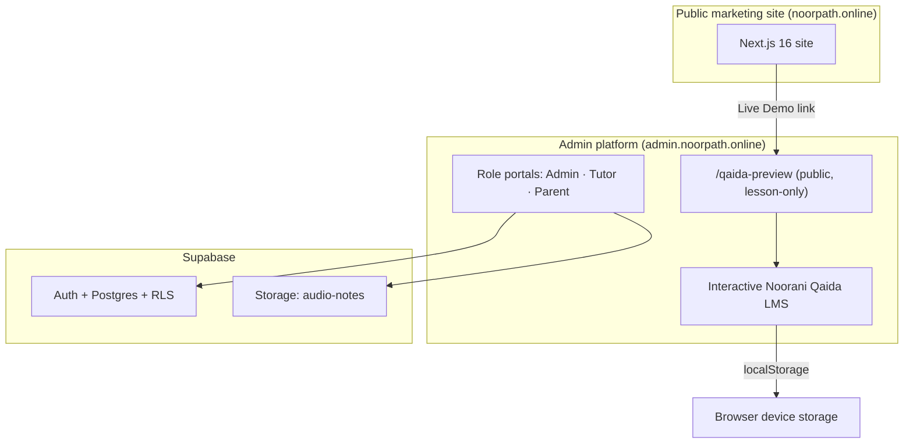

# NoorPath Admin Platform — Enterprise System Report

> Complete technical documentation and handover pack for the **NoorPath Admin Platform**
> (Next.js 14 · React 18 · TypeScript · Tailwind CSS · Supabase · Interactive Noorani Qaida LMS).
>
> **Status:** Documentation only — no application code was modified to produce this report.
> **Generated:** 2026-07-16 · **Repository:** `noorpath-admin`

---

## How to read this report

This documentation is written for a mixed enterprise audience — Solution Architects, Product Managers,
QA Leads, LMS Consultants and incoming engineers. Each chapter is self-contained and cross-links to
related chapters. Diagrams use [Mermaid](https://mermaid.js.org/) and render natively on GitHub and in
most Markdown viewers.

## Table of contents

| # | Document | Audience | What it covers |
|---|----------|----------|----------------|
| 1 | [overview.md](./overview.md) | All | Executive summary, purpose, vision, status |
| 2 | [architecture.md](./architecture.md) | Architects, Engineers | System architecture, folders, rendering, data flow, diagrams |
| 3 | [admin-panel.md](./admin-panel.md) | PM, Ops, Engineers | Every admin page in detail |
| 4 | [authentication.md](./authentication.md) | Security, Engineers | Login, roles, sessions, middleware, permissions |
| 5 | [noorani-qaida.md](./noorani-qaida.md) | All (flagship) | The full interactive LMS: engine, curriculum, rewards, modes |
| 6 | [feature-inventory.md](./feature-inventory.md) | PM, QA | Complete feature table with status & priority |
| 7 | [component-reference.md](./component-reference.md) | Engineers | Every component: props, responsibilities, usage |
| 8 | [animations.md](./animations.md) | Engineers, Design | Motion system, particles, confetti, reduced motion |
| 9 | [games.md](./games.md) | LMS, Design, Engineers | Game engine and all 7 mini-games |
| 10 | [parent.md](./parent.md) | PM, LMS | Parent dashboard & Qaida parent view |
| 11 | [teacher.md](./teacher.md) | PM, LMS | Tutor portal & Qaida teacher view |
| 12 | [student.md](./student.md) | PM, LMS | End-to-end learner journey |
| 13 | [seo.md](./seo.md) | Marketing, Engineers | SEO/entity architecture (admin + public bridge) |
| 14 | [performance.md](./performance.md) | Engineers | Bundle, lazy loading, rendering, bottlenecks |
| 15 | [accessibility.md](./accessibility.md) | QA, Engineers | ARIA, keyboard, screen readers, WCAG |
| 16 | [responsive.md](./responsive.md) | Design, Engineers | Breakpoints, layout strategy |
| 17 | [security.md](./security.md) | Security | Auth, authorization, data exposure, risks |
| 18 | [database.md](./database.md) | Engineers, DBA | Data model, storage, ER diagrams |
| 19 | [flowcharts.md](./flowcharts.md) | All | User journeys as Mermaid flowcharts |
| 20 | [roadmap.md](./roadmap.md) | PM, Leadership | Enterprise roadmap recommendations |
| 21 | [code-quality.md](./code-quality.md) | Engineers, Leads | Code audit, tech debt, refactors |
| 22 | [file-inventory.md](./file-inventory.md) | Engineers | Important file index |
| 23 | [scorecard.md](./scorecard.md) | Leadership | Enterprise readiness scorecard |
| 24 | [appendix.md](./appendix.md) | All | Glossary, conventions, known gaps register |

## System at a glance

## Key facts

| Attribute | Value |
|-----------|-------|
| Framework | Next.js **14.2.5** (App Router) |
| UI runtime | React **18.3.1** |
| Language | TypeScript **5.3.3** (`strict: true`) |
| Styling | Tailwind CSS **3.4.4** + custom design tokens |
| Backend | Supabase JS **2.39.3** (Auth + Postgres + Storage) |
| Animation | Framer Motion **^12.42.2**, GSAP **^3.15.0** |
| Audio | Howler **^2.2.4** + Web Speech API |
| Charts | Recharts **2.12.7** |
| Icons | lucide-react **0.400.0** |
| Dev port | 3001 |
| Roles | `admin`, `tutor`, `parent` (+ public preview) |
| LMS storage | Browser `localStorage` (key `noorpath-qaida-v5`) |

> **Traceability:** Findings in this report were produced by reading the source directly. Where a claim
> references a specific mechanism, the source file (and where useful, line range) is cited so future
> engineers can verify quickly.
