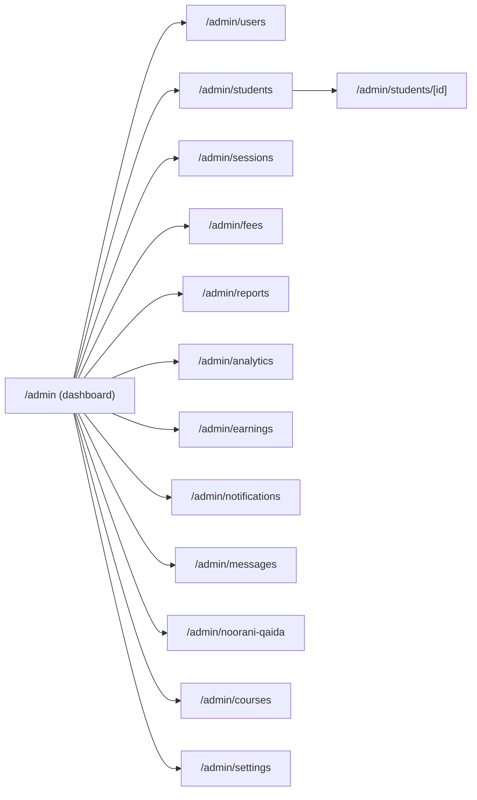

# 3. Admin Panel Documentation

The admin portal (`src/app/admin/*`) is the operational cockpit for the academy owner/administrator.
Every admin page is a **client component** exporting `dynamic = "force-dynamic"`, wrapped by a
**server-authenticated layout** (`admin/layout.tsx` → `authorizeAdmin()` → `AdminChrome` → `Sidebar`).
Only `role === "admin"` users reach these pages; tutors/parents are redirected to their own portals.

> Route-level auth detail is in [authentication.md](./authentication.md). Shared chrome
> (`Sidebar`, `TopBar`, `AdminChrome`) is documented in [component-reference.md](./component-reference.md).

## 3.1 Admin route map

| Route | Purpose | Primary data (Supabase) |
|-------|---------|-------------------------|
| `/admin` | Dashboard: KPIs + recent activity | `students`, `profiles`, `class_sessions`, `fees`, `progress_reports` |
| `/admin/users` | Manage tutors/parents/admins + availability | `profiles`, `tutor_availability` (+ admin API) |
| `/admin/students` | Student records CRUD | `students`, `profiles`, `courses` |
| `/admin/students/[id]` | Student detail hub | via `StudentProgressHub` |
| `/admin/courses` | Course catalog | `courses` |
| `/admin/sessions` | Class scheduling | `class_sessions`, `students`, `profiles` |
| `/admin/fees` | Invoicing / fee tracking | `fees`, `students` |
| `/admin/earnings` | Tutor payroll | `tutor_earnings`, `profiles` |
| `/admin/reports` | Progress report review | `progress_reports` |
| `/admin/analytics` | Business analytics (charts) | `fees`, `students`, `attendance` |
| `/admin/noorani-qaida` | Full interactive LMS (fullscreen) | Qaida `localStorage` |
| `/admin/messages` | Group chat (realtime) | `chat_messages`, `profiles` |
| `/admin/notifications` | Broadcast center | `notifications`, `profiles` |
| `/admin/profile` | Admin profile + password | `profiles`, `auth.updateUser` |
| `/admin/settings` | Reminder toggles + pending items | `fees`, `class_sessions`, `localStorage` |

---

## 3.2 Page-by-page

### `/admin` — Dashboard

- **Purpose:** At-a-glance operational health.
- **Who uses it:** Admin/owner.
- **UI:** Stat cards (students, sessions, revenue, reports), quick-action buttons, recent
  sessions + recent reports tables.
- **Actions:** Navigate to detail pages via quick actions and row links.
- **Business logic:** Aggregates counts and recent rows across five tables.
- **Data flow:** On mount → parallel Supabase selects → local state → cards/tables.
- **Connected pages:** All primary admin sections.
- **Future:** Real-time KPIs, date-range filters, drill-down, caching.

### `/admin/users` — User Management

- **Purpose:** Create and manage staff/family accounts and tutor availability.
- **UI:** Users table with search/role filters; create & edit modals; weekly availability grid;
  timezone checker.
- **Actions:** Create user (`POST /api/admin/create-user`), edit user
  (`POST /api/admin/update-user`), set availability, filter/search.
- **Permissions:** Admin only; API routes use the **service role** key (bypass RLS) and are gated by
  middleware.
- **Business logic:** Account provisioning sets `user_metadata.role` (used by the login redirect) and
  upserts `profiles`; availability is replaced on update.
- **Dependencies:** `tutor_availability`, `profiles`, admin API routes, `timezones.ts`.
- **Future:** Bulk import, audit trail, granular permissions, soft-delete/reactivation UX.

### `/admin/students` — Students

- **Purpose:** Manage student records and enrolment.
- **UI:** Filterable students table; add-student form; status badges (`trial_status`, `is_active`).
- **Actions:** Create student, filter by course/level/status, open detail.
- **Business logic:** Links students to `parent_id`/`tutor_id`; captures `course`, `level`, `source`.
- **Connected pages:** `/admin/students/[id]`, sessions, fees, reports.
- **Future:** Inline edit, CSV export, lifecycle (trial→enrolled→alumni) automation.

### `/admin/students/[id]` — Student Detail Hub

- **Purpose:** Single view of a student's learning record.
- **Implementation:** Delegates to shared **`StudentProgressHub`** (`role="admin"`).
- **UI:** Profile summary; period-filtered to-do/completed (daily work + roadmap); recent progress
  reports; add/toggle daily work notes.
- **Data:** `students` (with `profiles` joins), `daily_work_notes`, `course_roadmaps`,
  `progress_reports`.
- **Future:** Timeline unification, attendance overlay, export to PDF.

### `/admin/courses` — Courses

- **Purpose:** Maintain the course catalog.
- **UI:** Courses table; create form; active toggle.
- **Data:** `courses` (title, category, level, duration, price, currency, sort order, active).
- **Future:** Drag-order, curriculum linking, per-course pricing tiers.

### `/admin/sessions` — Sessions

- **Purpose:** Schedule and track live classes.
- **UI:** Sessions table; schedule form; status updates; meeting links.
- **Data:** `class_sessions` joined to `students` and tutor `profiles`.
- **Business logic:** Status lifecycle (`scheduled → completed/cancelled/rescheduled/no_show`).
- **Future:** Calendar view, recurring sessions, conflict detection, timezone rendering.

### `/admin/fees` — Fees

- **Purpose:** Track invoices and payments.
- **UI:** Fees table; invoice form; status badges (`pending/paid/overdue/waived`).
- **Data:** `fees`, `students`.
- **Future:** Payment gateway integration, automated reminders, receipts.

### `/admin/earnings` — Tutor Earnings

- **Purpose:** Manage tutor payroll.
- **UI:** Earnings table; add-earning + mark-paid forms.
- **Data:** `tutor_earnings`, `profiles`.
- **Note:** Two overlapping `tutor_earnings` schemas exist in SQL (see [database.md](./database.md)).
- **Future:** Auto-calculation from completed sessions, payout export.

### `/admin/reports` — Progress Reports

- **Purpose:** Review tutor-authored progress reports.
- **UI:** Reports list + detail panel.
- **Data:** `progress_reports` (coverage, rating, tajweed stars, homework, notes).
- **Future:** Filters by tutor/student/date, quality flags, parent-share status.

### `/admin/analytics` — Analytics

- **Purpose:** Business intelligence.
- **UI:** **Recharts** visualisations — revenue, students by country, lateness, attendance.
- **Data:** `fees`, `students`, `attendance`.
- **Future:** Cohort retention, LTV, funnel from trial → enrolment, exportable dashboards.

### `/admin/noorani-qaida` — Interactive LMS

- **Purpose:** Full interactive Noorani Qaida experience inside the admin app.
- **UI:** Fullscreen `QaidaShell` (own navigation; admin sidebar intentionally bypassed via
  `FULLSCREEN_ADMIN_ROUTES`).
- **Data:** Qaida `localStorage` (device-local).
- **Deep dive:** [noorani-qaida.md](./noorani-qaida.md).

### `/admin/messages` — Messages

- **Purpose:** Group chat across staff.
- **UI:** Chat thread + composer.
- **Data:** `chat_messages` + Supabase **realtime** channel (`postgres_changes`).
- **Note:** `chat_messages` has no `CREATE TABLE` in repo SQL (see [database.md](./database.md)).
- **Future:** Threads, DMs, attachments, moderation, safeguarding retention.

### `/admin/notifications` — Notifications

- **Purpose:** Broadcast announcements.
- **UI:** Notification list; broadcast form targeted by role.
- **Data:** `notifications`, `profiles`.
- **Future:** Scheduled sends, delivery channels (email/WhatsApp), read analytics.

### `/admin/profile` — Profile

- **Purpose:** Admin's own account.
- **UI:** Profile form + password-change tab.
- **Data:** `profiles`, `supabase.auth.updateUser`.

### `/admin/settings` — Settings

- **Purpose:** Operational reminders and pending-item triage.
- **UI:** Reminder toggles; pending fees/classes tables; WhatsApp quick links.
- **Data:** `fees`, `class_sessions`; preferences in `localStorage` (`noorpath_settings`).
- **Future:** Server-persisted org settings, role-based configuration.

## 3.3 Cross-page navigation

> Continue to [authentication.md](./authentication.md) →
