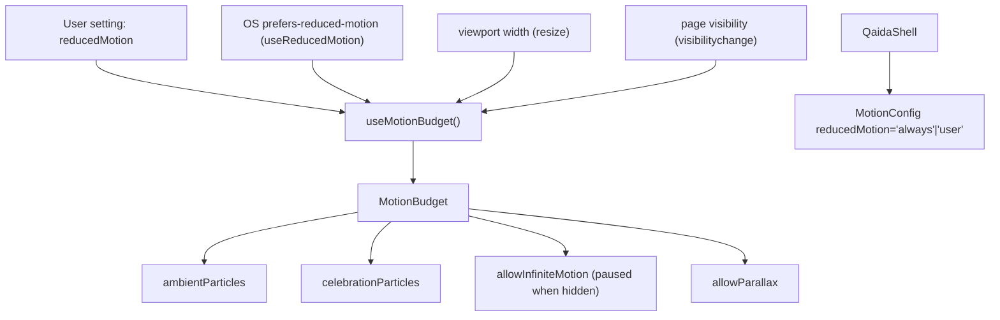

# 8. Animation Documentation

The Noorani Qaida uses a deliberate, **budgeted** motion system built on **Framer Motion** (with GSAP
available). Every ambient/celebration effect scales to the device and respects reduced-motion. All
decorative motion is `aria-hidden` and `pointer-events-none`.

## 8.1 Motion system architecture

### Motion budget tiers (`motion/config.ts`)

| Condition | Ambient | Celebration | Parallax | Infinite motion |
|-----------|:-------:|:-----------:|:--------:|:---------------:|
| Reduced motion | 0 | 12 | off | off |
| Width < 480px | 5 | 32 | off | on |
| Width < 1024px | 8 | 48 | off | on |
| Width ≥ 1024px | 12 | 72 | on | on |

`useMotionBudget()` defaults viewport to **1024** before first resize (SSR-safe desktop default) and
forces `allowInfiniteMotion=false` when the tab is hidden — pausing infinite ambient loops to save CPU.
`QaidaShell` wraps the app in `<MotionConfig reducedMotion={settings.reducedMotion ? "always" : "user"}>`.

### Shared variants
`pageVariants` (screen/game transitions), plus `childStaggerVariants`, `cardVariants`, `tapScale`
(defined, reserved). `QaidaShell` uses local dashboard container/item variants.

## 8.2 Animation components

| Component | Renders | Default count | Scaled by | Lifetime |
|-----------|---------|:-------------:|-----------|----------|
| `FloatingParticles` | Stars/dots/✨ bobbing | 20 (0–12 in prod) | `ambientParticles` | Infinite (paused when hidden) |
| `ScenicLearningBackground` | Sky/hills/mosque/trees/birds/leaves | 0–12 particles | `ambientParticles`, `allowInfiniteMotion` | Ambient |
| `StarBurst` | ⭐ radiating from center | 8 (6 in lessons) | prop | 0.8s one-shot |
| `SparkleBurst` | 12 SVG sparkles | 12 | — | 0.7s one-shot |
| `ConfettiExplosion` | Canvas physics confetti | 80 (12/32/48/72) | `celebrationParticles` | Self-terminating |
| `CoinRain` | Falling gold coins | 12 (shell passes 10, 0 reduced) | prop | 1.8s one-shot |

### Detail

- **FloatingParticles** — deterministic positions (`(i*31+7)%100`); each particle an infinite Framer
  loop (`y/x/opacity/scale`). Used on dashboard, PracticeHub, GamesHub, JourneyMap, ProgressScreen,
  NooraniBook. Cost scales with count — hence the budget cap.
- **ScenicLearningBackground** — cheap static SVG scene + a small number of animated nodes (clouds,
  birds, leaf/firefly particles) gated by `allowInfiniteMotion`. Used in `LessonScreen`,
  `TopicLessonScreen`.
- **StarBurst** — 360°/count radial burst, distance 40/60/90px by size, staggered `i*0.05`. Mounts
  only when `active`. Used in lessons + `LetterCard` completion.
- **SparkleBurst** — 12 sparkles scatter ±60px; `x`/`y` props declared but unused (always centered).
  Letter-tap and audio-play feedback.
- **ConfettiExplosion** — full-viewport `<canvas>` with real physics (gravity 0.5, rotation, fade after
  frame 40), `requestAnimationFrame`, self-terminates. Dynamically imported (`ssr: false`). Fired for
  3★ games and lesson/topic completion.
- **CoinRain** — coins fall `-60 → 110vh`, `rotateY 720`, staggered; fixed overlay `z-[9998]`.
  Lesson/topic completion.

## 8.3 Where animations fire

| Moment | Effect |
|--------|--------|
| Screen enter/exit | `pageVariants` |
| Letter tap | `SparkleBurst`, card pulse |
| Audio playing | `LetterCard` waveform, sparkle |
| Trace complete | overlay + mascot reaction |
| Lesson/topic complete | `ConfettiExplosion` + `CoinRain` |
| Game 3★ | `ConfettiExplosion` |
| XP/level/coin change | HUD badge value animation |
| Mascots | Zayd blink/sway/action; Owl bob |

## 8.4 Performance considerations

- **Budgeted particle counts** prevent low-end devices from running 70+ infinite loops.
- **Page-visibility pause** stops ambient loops on hidden tabs.
- **Canvas for the heaviest effect** (confetti) instead of dozens of DOM nodes; self-terminating RAF.
- **One-shot effects** (`StarBurst`, `SparkleBurst`, `CoinRain`) mount only while `active`.
- **Lazy import** of `ConfettiExplosion`/`TracingCanvas` keeps them out of the initial bundle.

## 8.5 Reduced-motion support (defence in depth)

1. **`useMotionBudget`** — `reduced` zeroes ambient particles, disables parallax/infinite motion,
   caps celebration to 12.
2. **`MotionConfig reducedMotion="always"`** — Framer respects the user setting app-wide.
3. **CSS fallback** — `qaida.css` `@media (prefers-reduced-motion: reduce)` forces ~0.01ms durations on
   all `.qaida-root` descendants.
4. **Shorter timings** — completion delays drop (e.g. game close 1500ms → 250ms) under reduced motion.

> Related: [performance.md](./performance.md) · [accessibility.md](./accessibility.md)
