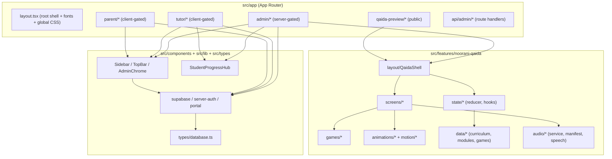
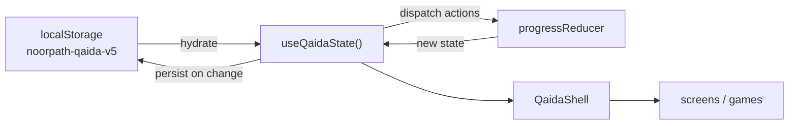
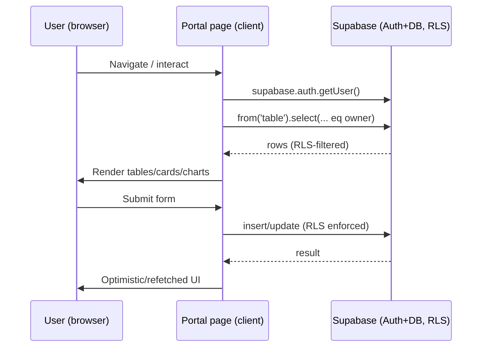
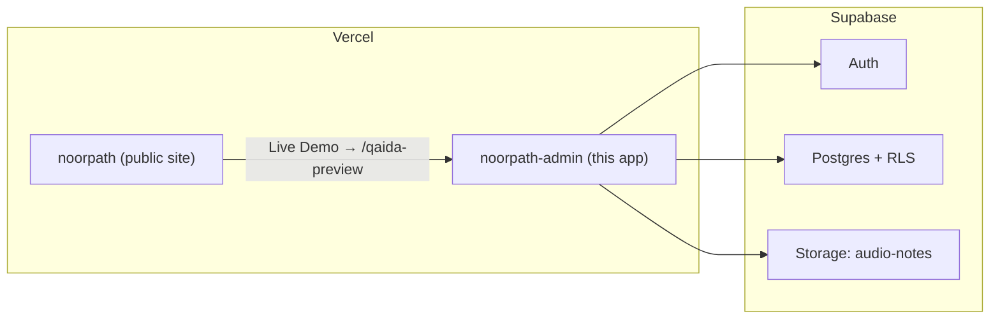

# 2. Complete System Architecture

## 2.1 Architectural style

The platform is a **feature-based, single-app Next.js 14 App Router** system with two clearly separated
concerns:

1. **Operations portals** (`src/app/admin`, `src/app/tutor`, `src/app/parent`) — thin, mostly
   client-rendered pages that talk directly to Supabase.
2. **Learning engine** (`src/features/noorani-qaida`) — a self-contained module with its own state
   machine, data, audio, motion and games; persists to `localStorage`.



## 2.2 Folder structure

```
noorpath-admin/
├── src/
│   ├── app/                       # App Router routes
│   │   ├── layout.tsx             # Root shell (fonts, global CSS, Qaida CSS)
│   │   ├── page.tsx               # "/" → client role redirect
│   │   ├── login/                 # Public login (role picker + Supabase)
│   │   ├── admin/                 # 16 admin pages + server layout (authorizeAdmin)
│   │   │   └── noorani-qaida/     # Fullscreen QaidaShell (no admin sidebar)
│   │   ├── tutor/                 # 14 tutor pages + client layout
│   │   ├── parent/                # 13 parent pages + client layout
│   │   ├── qaida-preview/         # Public, login-free lesson-only preview
│   │   └── api/admin/             # create-user / update-user (service role)
│   ├── features/
│   │   └── noorani-qaida/         # The interactive LMS (self-contained)
│   │       ├── layout/            # QaidaShell, QaidaSidebar, QaidaHUD
│   │       ├── screens/           # 16 screens (lesson, book, games hub, dashboards…)
│   │       ├── games/             # 7 games + GameShell
│   │       ├── animations/        # 6 animation components
│   │       ├── motion/            # motion budget + variants
│   │       ├── characters/        # Zayd, Owl mascots, LetterCard
│   │       ├── state/             # progress reducer, hooks, unlock logic
│   │       ├── data/              # curriculum, modules, games catalog
│   │       ├── audio/             # audio service, manifest, speech
│   │       ├── rewards/           # reward engine (pure)
│   │       ├── lesson/            # lesson flow state machine
│   │       ├── ui/                # loader, page-turn viewer, tracing canvas, fullscreen
│   │       ├── types/             # Qaida domain types
│   │       ├── fonts.ts           # Qaida Google fonts
│   │       └── qaida.css          # Scoped design system
│   ├── components/                # Shared chrome + StudentProgressHub
│   ├── lib/                       # supabase, server-auth, storage adapter, portal utils
│   ├── types/                     # database.ts (domain + Supabase Database type)
│   └── middleware.ts              # Admin route protection
├── supabase/                      # config.toml + migrations
├── scripts/qaida-contract-tests.cjs
├── public/                        # SVG icons only
├── *.sql                          # Schema, RLS, seed data
└── (config) next.config.mjs, tailwind.config.ts, tsconfig.json, eslint.config.mjs
```

## 2.3 Feature-based architecture

The `noorani-qaida` feature is a textbook **vertical slice**: everything it needs (UI, state, data,
audio, motion, tests) lives under one directory and communicates with the host app through a single
component (`QaidaShell`) and a tiny prop surface (`preview`, `enrolUrl`). This is why the same engine
serves three entry points — `/admin/noorani-qaida`, `/qaida-preview`, and (as embedded dashboards)
the parent/tutor Qaida views — without duplication.

## 2.4 Shared components

| Component | Role |
|-----------|------|
| `AdminChrome` | Admin layout wrapper; renders `Sidebar` + content, bypasses sidebar for fullscreen routes |
| `Sidebar` | Role-based navigation (admin/tutor/parent) + logout |
| `TopBar` | Sticky page header, hamburger toggle |
| `StudentProgressHub` | Shared student detail view for admin & tutor |
| `ParentStudentSwitcher` | Multi-child selector for parents |
| `NoorPathLogo`, `ui/ComingSoon` | Brand mark, placeholder (unused) |

Full detail in [component-reference.md](./component-reference.md).

## 2.5 State management

Two distinct strategies:

| Domain | Strategy |
|--------|----------|
| **Operations portals** | No global store. Each page fetches from Supabase into local React state (`useState`/`useEffect`). Cross-page continuity comes from the database, not client state. |
| **Noorani Qaida LMS** | A `useReducer`-based state machine (`state/progress.ts`) wrapped by the `useQaidaState()` hook, hydrated from and persisted to `localStorage`. Lesson-level UI uses a second reducer (`lesson/flow.ts`). Practice preferences use `usePracticeConfig()`. |



## 2.6 Contexts, hooks & utilities

- **No React Context providers** are used for global app state; the app favours local state + Supabase.
- **Hooks:** `useQaidaState`, `useMotionBudget`, `usePracticeConfig`, plus `useSidebarToggle` helper.
- **Utilities (`src/lib`):** `supabase.ts` (browser client + cookie-mirroring auth storage),
  `server-auth.ts` (`authorizeAdmin`), `supabase-auth-storage.ts` (storage adapter), `portal.ts`
  (formatting/date helpers — **not** auth), `timezones.ts`.

## 2.7 Data flow



For admin user management, writes go through **API route handlers** using the Supabase **service role**
key (bypassing RLS) — gated by middleware. See [authentication.md](./authentication.md).

## 2.8 Routing

App Router file-system routing. No route groups. Dynamic segments: `admin/students/[id]`,
`tutor/students/[id]`. Every operational page exports `dynamic = "force-dynamic"`. The three Qaida
entry points (`admin/noorani-qaida`, `parent/qaida`, `tutor/qaida`) are Server Components exporting
`metadata` with `robots: noindex`; `/qaida-preview` is `dynamic = "force-static"`. Full route table in
[admin-panel.md](./admin-panel.md) and [flowcharts.md](./flowcharts.md).

## 2.9 Rendering strategy

| Technique | Where used |
|-----------|------------|
| **Server Components** | Layouts (`admin/layout` does server auth), the three Qaida page shells, `/qaida-preview` page |
| **Client Components** | Virtually all interactive pages (`"use client"`) and the entire Qaida feature |
| **SSG** | `/qaida-preview` (`force-static`) |
| **SSR / dynamic** | All portal pages (`force-dynamic`) — data is per-user and live |
| **`ssr: false` dynamic imports** | `QaidaShell` and heavy Qaida screens/canvas/confetti to avoid SSR of browser-only APIs |

## 2.10 Dynamic imports & lazy loading

`QaidaShell` lazy-loads every screen and all 7 games with `next/dynamic({ ssr: false })`, each with a
`QaidaLoader` fallback. `TracingCanvas` and `ConfettiExplosion` are dynamically imported inside lesson
screens (they need `<canvas>` / browser APIs). This keeps the initial Qaida bundle small and defers
game/animation code until a learner actually opens them. See [performance.md](./performance.md).

## 2.11 Caching

- **Client data:** No dedicated cache layer (no SWR/React Query). Pages fetch on mount; freshness is
  favoured over caching, consistent with `force-dynamic`.
- **LMS progress:** `localStorage` acts as the durable cache/store for learning state, with legacy-key
  migration (`v4→v3→v2→original`).
- **Audio:** `preloadQaidaAudio()` warms `Audio` elements (`preload="metadata"`) for the current
  screen; recorded files (when present) can be cached by the browser/CDN.
- **Fonts:** Next Google Fonts with `display: swap`.

## 2.12 Performance strategy (summary)

Tiered **motion budget** scales particle counts to viewport and reduced-motion; page-visibility pauses
infinite animations; canvas is used for the heaviest celebration (confetti); lazy loading defers games
and screens. Detailed analysis in [performance.md](./performance.md).

## 2.13 Deployment topology



Both apps live in the same Vercel team; the admin app connects to Supabase via
`NEXT_PUBLIC_SUPABASE_URL` / `NEXT_PUBLIC_SUPABASE_ANON_KEY` (client) and `SUPABASE_SERVICE_ROLE_KEY`
(admin API routes only).

> Continue to [admin-panel.md](./admin-panel.md) →
