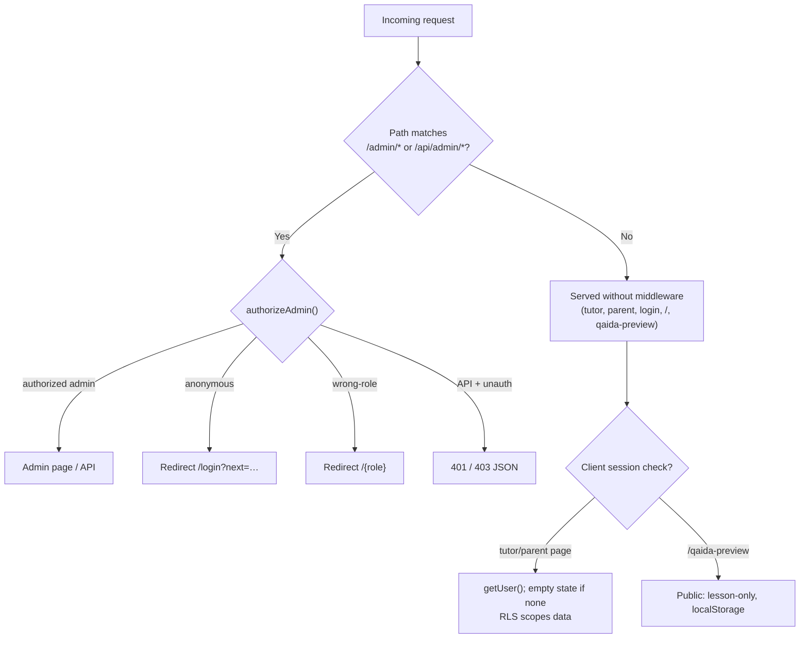

# 4. Authentication Flow

Authentication is built on **Supabase Auth** (email/password) with role information stored both in
`auth.users.user_metadata.role` and in the `profiles` table. Authorization is **asymmetric**: admin
routes are enforced server-side (middleware + layout), while tutor/parent routes rely on client-side
session checks plus Supabase **Row-Level Security (RLS)**.

## 4.1 Actors & entry points

| Actor | Entry | Enforcement |
|-------|-------|-------------|
| Admin | `/login` → `/admin` | **Server** (middleware + `admin/layout`) |
| Tutor | `/login` → `/tutor` | **Client** session + RLS |
| Parent | `/login` → `/parent` | **Client** session + RLS |
| Student/child | via Qaida UI (no separate auth) | None (device-local LMS) |
| Public visitor | `/qaida-preview` | None (intentional bypass) |

## 4.2 Login

`src/app/login/page.tsx` (client):

1. User selects a role (admin/tutor/parent) — **UI-only**, not verified against the DB.
2. `supabase.auth.signInWithPassword({ email, password })`.
3. **Role resolution order:** `user.user_metadata.role` → `profiles.role` → UI-selected role.
4. `router.replace('/' + actualRole)`.

> ⚠️ The middleware sets a `?next=` param on unauthorized redirects, but the login page does **not**
> consume it (users always land on their role home). Noted in [security.md](./security.md).

## 4.3 Session storage

Custom storage adapter `src/lib/supabase-auth-storage.ts` (key `noorpath-admin-auth-v1`):

- Browser client (`src/lib/supabase.ts`) writes the session to **localStorage** and **mirrors it to
  cookies** (`SameSite=Lax`, `Secure` on HTTPS, `Path=/`, ~1-year max-age) so the server/middleware can
  read it.
- Large sessions are **chunked** across `{key}.0…{key}.7` cookies with a `{key}.chunks` counter.
- One-time **legacy migration** from the default `sb-{ref}-auth-token` key.
- Cookies are written with `httpOnly: false` (must be JS-readable to share client↔server) — a known
  hardening item (see [security.md](./security.md)).

## 4.4 Roles & permissions

| Capability | Admin | Tutor | Parent | Public preview |
|------------|:-----:|:-----:|:------:|:--------------:|
| Access `/admin/*` | ✅ | ⛔ (→ `/tutor`) | ⛔ (→ `/parent`) | ⛔ |
| Access `/tutor/*` | (via role) | ✅ | — | — |
| Access `/parent/*` | (via role) | — | ✅ | — |
| Create/edit users (API) | ✅ | ⛔ | ⛔ | ⛔ |
| Manage all students/sessions/fees | ✅ | scoped (RLS) | read own children (RLS) | — |
| Write progress reports/homework | ✅ | ✅ | ⛔ | — |
| Open Noorani Qaida (full) | ✅ | (via `/tutor/qaida` view) | (via `/parent/qaida` view) | lesson-only |

RLS is the true data-scoping boundary for tutor/parent (`.eq('tutor_id', user.id)`,
`.eq('parent_id', user.id)`), reinforced by helper functions `current_profile_role()` / `is_admin()`.

## 4.5 Middleware

`src/middleware.ts` — matcher `["/admin/:path*", "/api/admin/:path*"]` only:

- Calls `authorizeAdmin()` with a cookie adapter.
- **Unauthorized page** → redirect to `/login?next={path}`.
- **Wrong role** → redirect to `/{role}`.
- **Unauthorized API** → `401` (anonymous) or `403` (authenticated non-admin).

Everything outside the matcher — `/tutor/*`, `/parent/*`, `/login`, `/`, `/qaida-preview` — is **not**
middleware-protected.

## 4.6 Server authorization (`authorizeAdmin`)

`src/lib/server-auth.ts` (`authorizeAdmin`, lines ~65–90):

1. Build server Supabase client from cookies.
2. `auth.getUser()` → if none, `reason: "anonymous"`.
3. Load `profiles.role, full_name, is_active`.
4. If missing/inactive → `reason: "inactive"`.
5. If `role !== "admin"` → `reason: "wrong-role"` + role.
6. Else authorized (returns `user`, `role`, `fullName`).

Used by **both** the middleware and `admin/layout.tsx`, giving admin routes **double enforcement**.

## 4.7 Protected routes & the public bypass

The `/qaida-preview` route lives **outside** the matcher by design (documented in its layout) so
website visitors reach the Alif lesson without logging in; it is `robots: noindex` and stores progress
only in the browser.

## 4.8 API authentication

| Route | Middleware | In-handler check | Credentials |
|-------|:----------:|:----------------:|-------------|
| `POST /api/admin/create-user` | ✅ admin | none | `SUPABASE_SERVICE_ROLE_KEY` |
| `POST /api/admin/update-user` | ✅ admin | none | `SUPABASE_SERVICE_ROLE_KEY` |

Route handlers trust the middleware for authorization and do not re-verify the caller — acceptable
given the matcher, but adding a defence-in-depth check is recommended in [security.md](./security.md).

## 4.9 Logout

`Sidebar` → `supabase.auth.signOut()` → clears localStorage + cookies (via the storage adapter) →
`router.replace('/login')`.

## 4.10 Student & public-preview "auth"

There is **no student login**. The learner experience is device-local: progress is keyed to the
browser via `localStorage`. The public preview is deliberately anonymous and lesson-scoped
(`preview` prop on `QaidaShell`, only the Alif lesson unlocked). This is a conversion surface, not an
authenticated account.

> Continue to [noorani-qaida.md](./noorani-qaida.md) →
