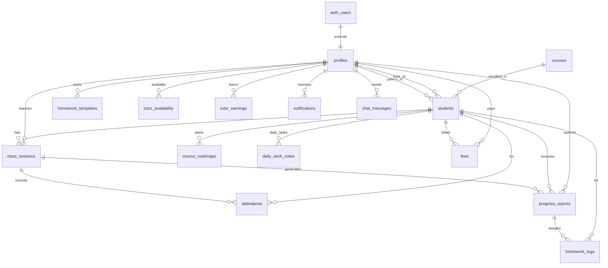

# 18. Database & Data Model

## 18.1 Storage overview

The platform uses **two independent stores**:

| Store | Scope | Used for |
|-------|-------|----------|
| **Supabase Postgres** (with RLS) | Server, multi-user | All operations data: users, students, sessions, attendance, reports, homework, roadmap, fees, earnings, notifications, chat |
| **Browser `localStorage`** | Device-local | Noorani Qaida learning progress (`noorpath-qaida-v5`), practice config, admin settings |

Plus **Supabase Storage** bucket `audio-notes` for tutor audio in progress reports.

> **Key gap:** Qaida learning progress is **not** in Postgres. This limits cross-device continuity and
> real parent/teacher analytics — the top persistence item in [roadmap.md](./roadmap.md).

## 18.2 Domain types

`src/types/database.ts` defines the intended app schema (interfaces + a Supabase `Database` wrapper).
Union types: `Role`, `AttendanceStatus`, `SessionStatus`, `FeeStatus`, `TrialStatus`, `OverallRating`,
`EarningStatus`, `CourseLevel`, `CourseRoadmapStatus`, `LessonType`, `DailyWorkNoteStatus`. Registered
tables: `profiles`, `courses`, `students`, `class_sessions`, `attendance`, `progress_reports`,
`course_roadmaps`, `daily_work_notes`, `homework_logs`, `homework_templates`, `fees`, `notifications`,
`messages`, `chat_messages`, `tutor_earnings`.

## 18.3 Core ER diagram



## 18.4 Table inventory

| Table | Key columns | Relationships | Source SQL |
|-------|-------------|---------------|-----------|
| `profiles` | `id` PK | → `auth.users(id)` cascade | `supabase-schema.sql` |
| `students` | `id`, `parent_id`, `tutor_id`, `referral_by`, `course`, `level`, `trial_status` | → `profiles`, → `courses` | `supabase-schema.sql` |
| `courses` | `id`, `title`, `category`, `level`, `price_amount`, `currency`, `is_active`, `sort_order` | standalone catalog | `courses-table.sql` |
| `class_sessions` | `id`, `student_id`, `tutor_id`, `scheduled_at`, `status`, `meeting_link` | → `students`, `profiles` | `supabase-schema.sql` |
| `attendance` | `id`, `session_id`, `student_id`, `status`, `late_minutes`, `tutor_id`, `session_date` | → `class_sessions`, `students`, `profiles` | `supabase-schema.sql` + `supabase-missing-tables.sql` |
| `progress_reports` | `id`, `session_id`, `student_id`, `tutor_id`, `overall_rating`, `tajweed_stars`, `homework` | → `class_sessions`, `students`, `profiles` | `supabase-schema.sql` |
| `homework_logs` | `id`, `report_id`, `student_id`, `tutor_id`, `template_id`, `status`, `due_date` | → `progress_reports`, `students` | `supabase-schema.sql` + missing-tables |
| `homework_templates` | `id`, `tutor_id`, `title`, `content`, `subject`, `level` | → `profiles` | `supabase-schema.sql` + missing-tables |
| `course_roadmaps` | `id`, `student_id`, `tutor_id`, `title`, `lesson_type`, `order_index`, `status` | → `students`, tutor | `roadmap-table.sql` |
| `daily_work_notes` | `id`, `student_id`, `tutor_id`, `work_date`, `work_text`, `status` | → `students`, `profiles` | `daily-work-notes-table.sql` |
| `fees` | `id`, `student_id`, `parent_id`, `amount`, `period_month/year`, `status` | → `students`, `profiles` | `supabase-schema.sql` |
| `tutor_earnings` | `id`, `tutor_id`, `month`, `year`, `total_amount`, `status` | → `profiles` | `supabase-schema.sql` (⚠ alt shape in missing-tables) |
| `tutor_availability` | `id`, `tutor_id`, `day_of_week`, `start_time`, `end_time` | → `profiles` | `tutor-availability-table.sql` |
| `notifications` | `id`, `recipient_id`, `type`, `title`, `message` | → `profiles` (⚠ alt broadcast shape) | `supabase-schema.sql` + missing-tables |
| `messages` | `id`, `sender_id`, `recipient_id`, `student_id`, `message` | → `profiles`, `students` (⚠ alt shape) | `supabase-schema.sql` + missing-tables |
| `chat_messages` | `id`, `sender_id`, `body`, `created_at` | → `profiles` (inferred) | ⚠ **no CREATE TABLE in repo** (used by app, seeded in `dummy-data.sql`) |
| `kids_studio_progress` / `kids_studio_assignments` | — | legacy | **dropped** (`20260715000000_retire_kids_studio.sql`) |

## 18.5 Storage & DB functions

| Object | Purpose | Source |
|--------|---------|--------|
| Bucket `audio-notes` | Tutor audio in reports (public read, auth upload) | `audio-storage-setup.sql` |
| `handle_new_user()` | Auto-insert `profiles` on signup | `supabase-schema.sql` |
| `current_user_role()` / `current_profile_role()` / `is_admin()` | RLS helpers | `rls-policies-dashboard-fix.sql` |

## 18.6 Qaida progress data model (client)

`QaidaProgress` (localStorage `noorpath-qaida-v5`) — see [noorani-qaida.md](./noorani-qaida.md) §5.10.
If persisted to Postgres, a natural schema:

```mermaid
erDiagram
  students ||--|| qaida_progress : has
  qaida_progress {
    uuid student_id PK_FK
    int xp
    int coins
    int level
    int streak
    date last_study_date
    jsonb completed
    jsonb ratings
    jsonb settings
    timestamptz updated_at
  }
  qaida_progress ||--o{ qaida_assessment_attempts : records
  qaida_progress ||--o{ qaida_badges : earned
  qaida_progress ||--o{ qaida_game_results : logs
```

## 18.7 Schema drift — reconciliation required 🔴

Root SQL files define **conflicting shapes** for `notifications`, `messages`, `homework_*` and
`tutor_earnings` (`month INT` vs `TEXT`, `total_amount` vs `amount`). `chat_messages` is used by the app
but has no `CREATE TABLE` in the repo. The Supabase migration `20260702000000_initial_schema.sql`
duplicates `supabase-schema.sql`. **Before scaling, reconcile to a single canonical migration set** and
verify RLS on every table (esp. `chat_messages`). See [security.md](./security.md) §17.6.

## 18.8 Seed data

`dummy-data.sql`, `demo-data-full.sql`, `demo-data-v2.sql`, `demo-reports.sql` provide demo profiles,
students, sessions, reports, attendance, homework, earnings and fees. `config.toml` references a
`./seed.sql` that is **absent** from the repo.

> Related: [architecture.md](./architecture.md) · [security.md](./security.md) · [roadmap.md](./roadmap.md)
