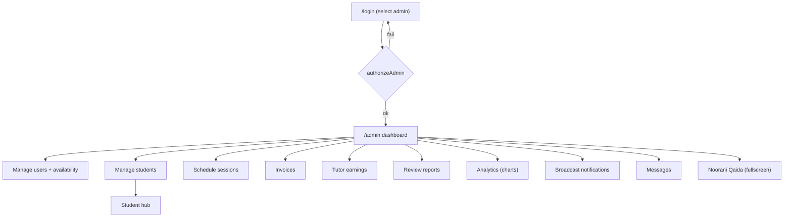
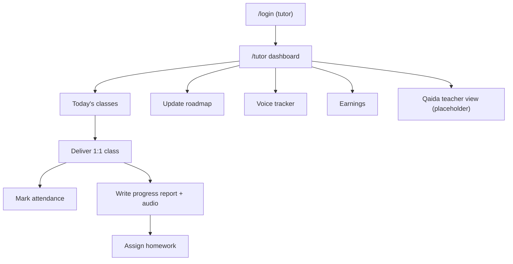
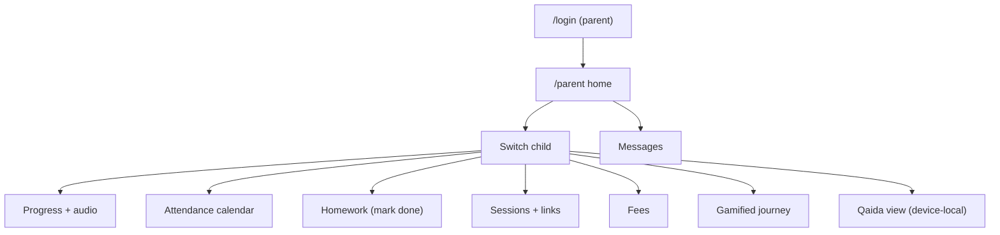
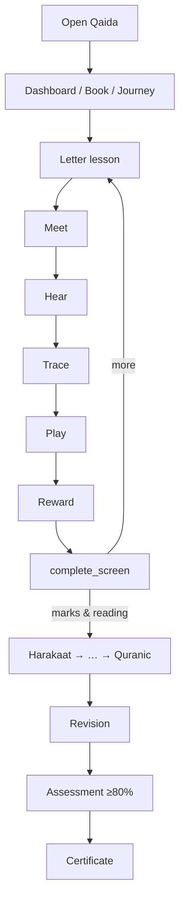
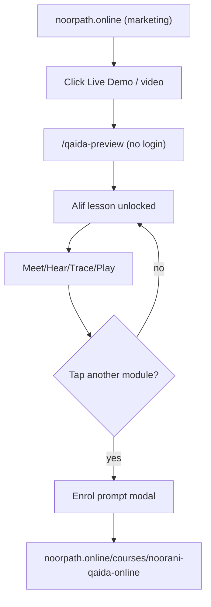
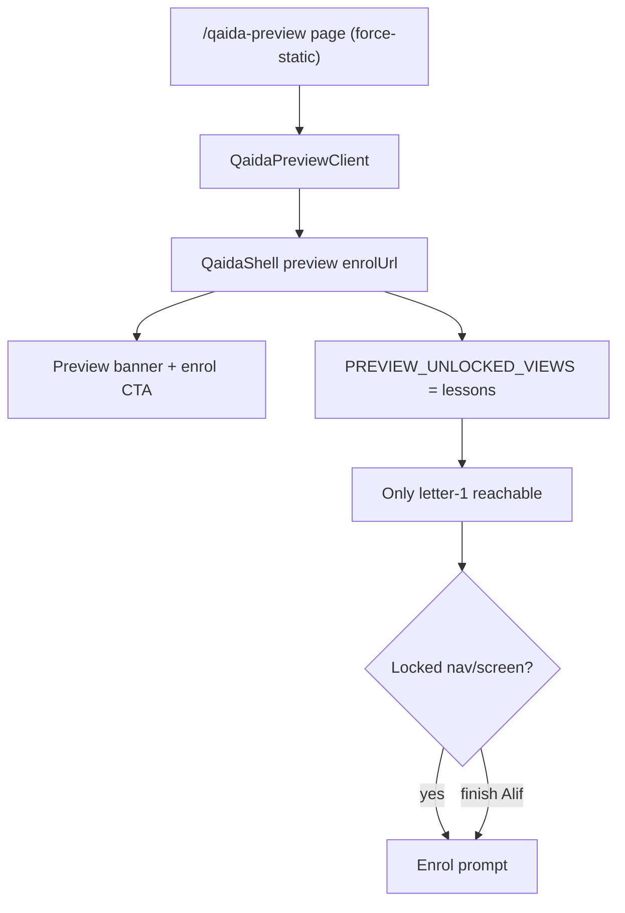
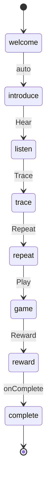
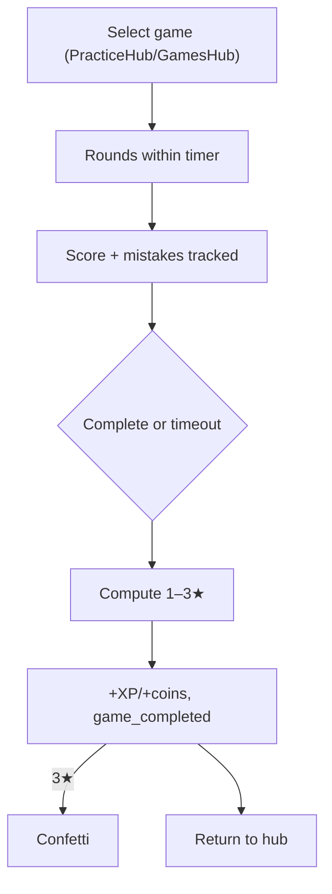
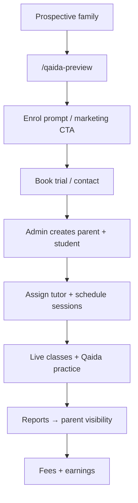
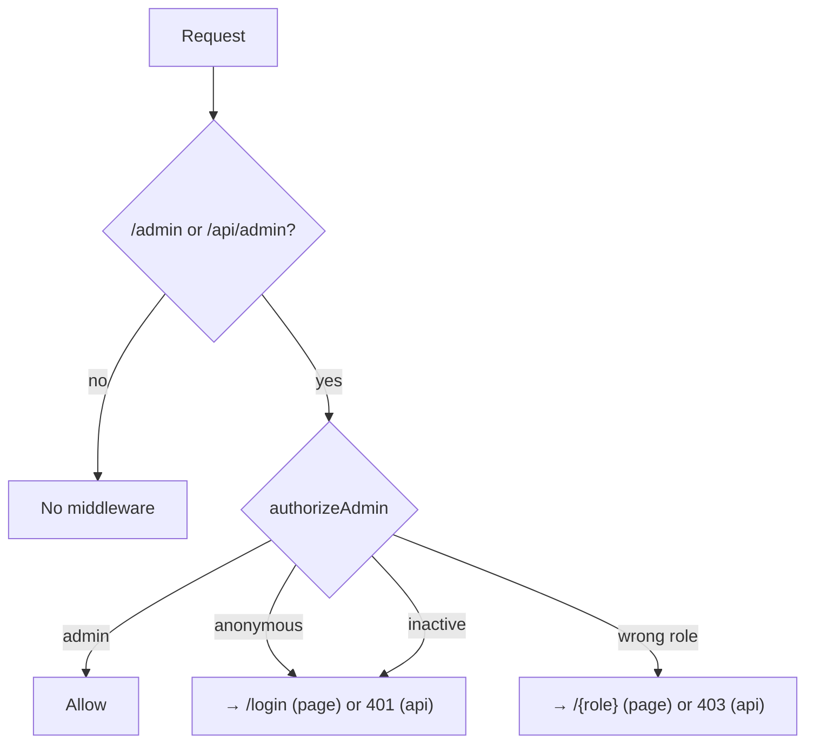

# 19. User Journey Documentation

Mermaid flowcharts for every major journey. Render on GitHub or any Mermaid-aware viewer.

## 19.1 Admin journey

## 19.2 Teacher journey

## 19.3 Parent journey

## 19.4 Student (learner) journey

## 19.5 Public visitor journey

## 19.6 Interactive demo journey (preview internals)

## 19.7 Lesson journey (state machine)

## 19.8 Game journey

## 19.9 Enrollment journey (business)

## 19.10 Authentication decision tree

> Related: [authentication.md](./authentication.md) · [noorani-qaida.md](./noorani-qaida.md)
