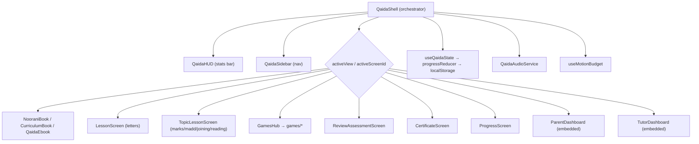
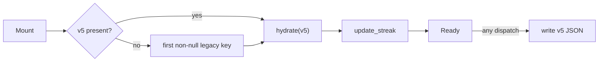
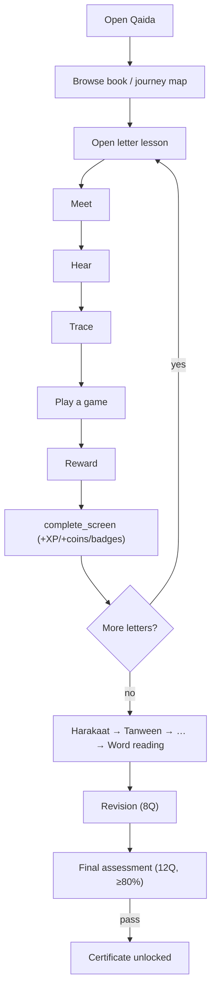

# 5. Noorani Qaida Platform (Flagship Chapter)

The **Interactive Noorani Qaida** is the heart of NoorPath — a gamified, self-contained learning engine
that takes a child from the 28-letter Arabic alphabet through to Quran-reading foundations. It lives
entirely under `src/features/noorani-qaida/` and is mounted from three entry points:

| Entry | Mode | Access |
|-------|------|--------|
| `/admin/noorani-qaida` | Full engine, fullscreen | Admin (server-gated) |
| `/qaida-preview` | Preview (Alif lesson only) | Public, login-free |
| `/parent/qaida`, `/tutor/qaida` | Embedded dashboards | Portal views |

---

## 5.1 The two curriculum representations

The feature deliberately maintains **two parallel curriculum models** — a source of both flexibility
and potential confusion for future maintainers:

| Layer | File | Purpose | Screen IDs |
|-------|------|---------|-----------|
| **Book / Table of Contents** | `data/curriculum.ts` (`CURRICULUM`, `LETTERS`) | Interactive book navigation, guides, alphabet chart | Aggregate IDs: `harakat-intro`, `tanween`, `madd`, `joining`, `assessment`… |
| **11-module learning path** | `data/modules.ts` (`CURRICULUM_MODULES`, `TOPIC_LESSONS`) | **Authoritative progress tracking** | Granular IDs: `fatha`/`kasra`/`damma`, `fathatain`…, `madd-alif`/`madd-waw`/`madd-ya`, `final-assessment` |

> **Progress, unlock and completion math are driven by `modules.ts`.** The book TOC is for browsing.
> Mixing the two ID namespaces in analytics would misreport progress — flagged in
> [code-quality.md](./code-quality.md).

## 5.2 The 11 modules

| # | Module `id` | Title | Screens | Count |
|---|-------------|-------|---------|------:|
| 1 | `alphabet` | Arabic Alphabets | `letter-1 … letter-28` | 28 |
| 2 | `harakaat` | Harakaat | `fatha`, `kasra`, `damma` | 3 |
| 3 | `double-harakaat` | Double Harakaat (Tanween) | `fathatain`, `kasratain`, `dammatain` | 3 |
| 4 | `sukoon` | Sukoon | `sukoon` | 1 |
| 5 | `shaddah` | Shaddah | `shaddah` | 1 |
| 6 | `madd` | Madd | `madd-alif`, `madd-waw`, `madd-ya` | 3 |
| 7 | `joining` | Letter Joining | `joining-forms` | 1 |
| 8 | `word-reading` | Word Reading | `reading-2 … reading-5` | 4 |
| 9 | `quranic-practice` | Quranic Practice | `quran-words`, `quran-recognition`, `quran-reading` | 3 |
| 10 | `revision` | Revision | `mixed-revision`, `reading-revision` | 2 |
| 11 | `final-review` | Final Review | `final-assessment`, `teacher-review`, `parent-practice`, `certificate` | 4 |

**Totals:** 53 screen IDs; **52 required** for completion (`certificate` excluded from completion math).
Each module declares a `prerequisite`, but **prerequisites are informational only** — see §5.9.

## 5.3 Interactive ebook

Three complementary book experiences:

- **`NooraniBook`** — hub with two view modes (interactive eBook via `CurriculumBook`, or a letter-card
  grid), circular progress ring, mascot, and fullscreen toggle.
- **`CurriculumBook`** — chapter navigator across all 11 modules using `PageTurnViewer`; the alphabet
  module embeds `QaidaEbook`, other modules render one topic page per screen.
- **`QaidaEbook`** — traditional single-page book with all 28 letters in an RTL 4×7 grid and a sticky
  "reading bar" (Again / Slow / Lesson →).

`PageTurnViewer` is an accessible digital book: RTL-aware arrow keys, Home/End, ≥48px swipe, optional
two-page spread on large screens, `aria-roledescription="digital book"`, and focus moved to the page
heading on change.

## 5.4 Lesson engine

Two lesson UIs, chosen by content type:

### Alphabet letters → `LessonScreen`

Driven by the `lesson/flow.ts` state machine. Steps (internal → UI label):

| Step | UI | Trigger |
|------|----|---------|
| `welcome` | — | auto on mount |
| `introduce` | **Meet** | auto after welcome |
| `listen` | **Hear** | auto pronounce; listen tab |
| `trace` | **Trace** | `TracingCanvas` completion |
| `repeat` | **Repeat** | repeat tab |
| `game` | **Play** | `gameCompletionCount ≥ 1` |
| `reward` | **Reward** | "Next" button |
| `complete` | — | after reward → `onComplete()` |

`LessonScreen` renders a 3-column layout (Zayd mascot + speech, `LetterCard`, letter info + activity
tabs), an `ActivityWorkspace` (tracing/write/repeat), a horizontal game strip, a reward panel, and a
footer with the Owl mascot and badges. Write/repeat are self-report ("I finished writing"); tracing is
validated (see §5.13).

### Marks / Madd / Joining / Reading / Quranic / Revision / Assessment → `TopicLessonScreen`

A richer topic UI: hero (mascot + large Arabic example + explanation), "Listen and explore" example
grid, conditional sections (joining-forms grid, animated reading path for reading/quranic/revision/
assessment kinds, Madd 2-count stretch animation, tracing preview when `traceValue` present), and
teacher/parent tips. Completion calls `onComplete()` which the shell turns into `complete_screen`.

## 5.5 Alphabet system (28 letters)

Each `Letter` (`types/index.ts`) carries: `id`, `letter`, `name`, `sound`, four joining `forms`
(isolated/initial/medial/final), `example` + `meaning`, `makharij`/`mouthPosition`, auto-generated
child/teacher/parent notes, `writingHint`, `audioKey` (`letter-{id}`), and `reviewStatus`
(`pending-qari-review`). Letters are authored as compact tuples then expanded via `.map()`. Non-letter
screens resolve a deterministic stand-in letter via a hash (`lessonLetterForScreen`).

## 5.6 Marks & rules — Harakaat, Tanween, Sukoon, Shaddah, Madd

These are modelled as **`TopicLesson`** records (`kind: "mark" | "madd"`), each with `title`,
`arabicTitle`, `summary`, child/teacher/parent guidance, optional `traceValue` (e.g. `بَ`, `بً`, `بَا`),
`audioKey`, and interactive `examples`. Coverage:

| Concept | Module | Lessons |
|---------|--------|---------|
| Harakaat (short vowels) | `harakaat` | Fatha, Kasra, Damma |
| Tanween (double vowels) | `double-harakaat` | Fathatain, Kasratain, Dammatain |
| Sukoon | `sukoon` | Sukoon |
| Shaddah | `shaddah` | Shaddah |
| Madd (elongation) | `madd` | Madd Alif, Madd Waw, Madd Ya |

## 5.7 Joining, word reading & Quranic practice

- **Joining** (`joining-forms`) teaches how letters change shape in position, with a forms grid.
- **Word reading** (`reading-2 … reading-5`) builds from 2- to 5-letter words using the reading-path
  animation.
- **Quranic practice** (`quran-words`, `quran-recognition`, `quran-reading`) bridges to real Quran text.

## 5.8 Revision & assessment

`ReviewAssessmentScreen` powers both:

| Mode | Questions | Pass |
|------|-----------|------|
| `revision` | 8 | recorded as `ReviewSummary` |
| `assessment` | 12 | **≥ 80%** → `passed: true` |

Questions are MCQs assembled from letters + topic examples (`makeQuestions()` shuffles the pool).
Tapping the Arabic prompt plays audio; correct/retry sounds fire; auto-advance after 850ms
(250ms under reduced motion). The final assessment result is recorded as an `AssessmentAttempt`.

## 5.9 Unlock logic

**Everything is unlocked.** `isCurriculumScreenUnlocked()` returns `true` for `cover`, `toc`, and any
screen belonging to a module; `isModuleUnlocked()` always returns `true`. Progress is still tracked,
but no chapter/lesson/letter is gated.

- Declared module `prerequisite` chains are **documentation only**.
- `navigate()` still calls `isScreenUnlocked` and would show *"Complete the previous lesson to unlock
  this one!"* for a blocked ID — but no module screen is ever blocked. Book-only screens
  (`how-to`, `alphabet-chart`, `harakat-intro`…) are not covered by the unlock function.

This reflects an explicit product decision: free exploration for children, with progress as
encouragement rather than a gate.

## 5.10 Progress model & persistence

`QaidaProgress` (`types/index.ts`) — the single source of learner truth:

| Field | Meaning |
|-------|---------|
| `xp`, `coins`, `stars`, `level`, `xpMax` | Gamification counters (`stars` = sum of screen ratings) |
| `streak`, `lastStudyDate` | Consecutive study-day tracking |
| `completed[]` | Screen IDs completed (idempotent) |
| `ratings` | Per-screen 1–3 stars |
| `badges[]` | 16-badge catalog with earned state |
| `gamesCompleted`, `totalPracticeSeconds` | Activity counters |
| `currentScreenId` | Resume point |
| `assessmentAttempts[]`, `reviewSummaries[]` | Append-only histories |
| `settings` | previewMode, theme, audioEnabled, reducedMotion |
| `hydrated`, `version` | Lifecycle (version pinned to **5**) |

**Persistence** (`useQaidaState`): hydrate from `noorpath-qaida-v5`, falling back to the first legacy
key (`v4 → v3 → v2 → noorpath-qaida-progress`); run `update_streak` on load; persist the whole object
to `localStorage` on every change. Legacy keys are read but not deleted.

## 5.11 Reducer actions

`progressReducer` handles: `hydrate`, `complete_screen` (+25 XP, +10 coins, idempotent),
`earn_xp`, `earn_coins`, `rate_screen`, `game_completed`, `set_current_screen`, `record_assessment`,
`record_review`, `add_practice_time`, `update_streak`, `update_settings`, `reset`. Most mutating actions
re-run `awardBadgesForState()`. Full table in [feature-inventory.md](./feature-inventory.md).

## 5.12 XP, coins, levels, badges, rewards & achievements

| Mechanic | Rule |
|----------|------|
| **Screen complete** | +25 XP, +10 coins |
| **Letter lesson bonus** | +15 coins (shell) |
| **Game complete** | `stars × 15` XP, `stars × 5` coins; 3★ → confetti |
| **Level** | `max(1, floor(xp / 300) + 1)` |
| **Stars** | Sum of all per-screen ratings |
| **Badges** | 16 achievements auto-awarded (see below) |

**Badge catalog & conditions** (`awardBadgesForState`): first/five/ten/all letters, first/five games,
streak-3/7, level-2/5, coins-100, vowel-explorer (harakaat complete), word-reader, quran-ready,
qaida-graduate (final assessment passed). Known gaps: `perfect-game` badge has **no condition**;
`rate_screen` action is **never dispatched** (see [code-quality.md](./code-quality.md)).

The **reward engine** (`rewards/rewardEngine.ts`) provides pure `calculateGameReward()` /
`summarizeReward()` used by contract tests, but the shell dispatches rewards inline — a duplication to
consolidate.

## 5.13 Tracing

`ui/TracingCanvas.tsx` + pure `ui/tracingValidation.ts`:

1. Canvas draws the letter as a faint fill + dashed guide (using `--font-qaida-arabic`).
2. A hidden offscreen canvas renders a solid mask for pixel sampling.
3. Pointer events capture strokes (with `setPointerCapture`), drawn live in emerald.
4. On stroke finish, for each point it samples ±15px (DPR-scaled) of the mask for coverage and sums
   path distance, then calls `validateTrace()`.

**Scoring:** `score = accuracy×76 + lengthScore×24`; **pass when `score ≥ 68` AND `strokeCount ≥ 2`**
(prevents a single scribble). A keyboard/accessibility bypass ("shape reviewed") sets score 100 and
completes. `ResizeObserver` redraws; changing the letter resets state.

## 5.14 Audio & pronunciation

Three layers:

- **`speech.ts`** — Web Speech API (`ar-SA` rate ~0.8, `en-GB`).
- **`QaidaAudioService`** — orchestrates file playback with speech fallback; API: `configure`,
  `setEnabled`, `stop`, `pronounce({key, fallbackText, mode, repeat})`, `feedback`, `effect`
  (tap/correct/retry/coin/reward/level-up).
- **`manifest.ts`** — audio keys for every letter/lesson/example with preload tiers.

**Resolution order:** disabled → return; else stop prior; look up recorded URL (`normal`/`slow`); play
file or **fall back to device TTS** (rate 0.78 normal / 0.55 slow). Currently **no recorded URLs are
populated**, so all pronunciation uses device TTS until Qari recordings are added (`reviewStatus:
pending-qari-review`).

## 5.15 Games (overview)

Seven mini-games reinforce recognition, ordering, memory and listening. All receive a 6-letter
contiguous window (`letterWindow`) around the current letter and report `onComplete(stars)`; the shell
awards `stars × 15` XP / `stars × 5` coins. Full breakdown in [games.md](./games.md).

## 5.16 Certificates

`CertificateScreen` is **gated on a passed final assessment** (`assessmentAttempts` with
`screenId === "final-assessment"` && `passed`). Locked state shows curriculum %; unlocked shows an
ornamental certificate (Bismillah, module summary, XP/stars/streak, teacher-verification disclaimer).
It is presentational HTML/CSS — no PDF/print generation yet.

> ⚠️ **Naming inconsistency:** the sidebar "Certificates" item routes to `ProgressScreen`, not
> `CertificateScreen`; the certificate renders only when `currentScreenId === "certificate"`.

## 5.17 Navigation & the shell

`QaidaShell` is the orchestrator: it owns `activeView` (sidebar destination) and `activeScreenId`
(lesson route), wires `QaidaHUD`, `QaidaSidebar` (desktop + mobile), lazy-loads all screens/games,
dispatches rewards, drives confetti/coin-rain celebrations, and applies the `MotionConfig`
reduced-motion preference.

## 5.18 Modes: preview, teacher, parent, student, public

| Mode | How | Behaviour |
|------|-----|-----------|
| **Student (default)** | full engine | All modules explorable; full gamification |
| **Public preview** | `QaidaShell preview` | Only Alif (`letter-1`) unlocked; other nav items locked → **enrol prompt** modal; preview banner with enrol CTA; `userName="Guest"` |
| **Parent** | `activeView="parents"` → `ParentDashboard embedded` | Reads device `localStorage`; stat cards, module, 28-letter grid, badges; "this browser only" disclaimer; cross-tab `storage` sync |
| **Teacher** | `activeView="teachers"` → `TutorDashboard embedded` | Integration-ready placeholder; "Awaiting verified data" |
| **Settings** | `SettingsScreen` | Audio + reduced-motion toggles; device reset |

Preview lock UX: `QaidaSidebar` receives `unlockedViews`/`onLockedSelect`; locked items render
grayscale + 🔒 with `aria-disabled`; tapping a locked item or finishing Alif surfaces the enrol modal.

## 5.19 End-to-end learner sequence

> Continue to [games.md](./games.md) · [animations.md](./animations.md) ·
> [component-reference.md](./component-reference.md)
