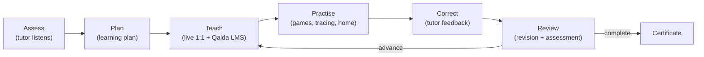

# 1. Executive Summary

## 1.1 What NoorPath is

**NoorPath** is a founder-led online Quran education academy. The **NoorPath Admin Platform**
(this repository, `noorpath-admin`) is the operational back-office and learning-delivery system that
powers the academy. It is a single Next.js application that serves **three authenticated role portals**
(Admin, Tutor, Parent) plus a flagship **Interactive Noorani Qaida** learning module and a **public,
login-free preview** of that module.

It is deployed at `admin.noorpath.online` and is a sibling to the public marketing site
(`noorpath.online`), which links visitors into the admin platform's public Qaida preview.

## 1.2 Purpose

The platform exists to run the day-to-day business of an online Quran academy and to deliver
self-paced Arabic-literacy learning:

- **Operate the academy** — manage students, tutors, courses, class sessions, attendance, fees,
  tutor earnings, progress reports, homework, roadmaps, messaging and notifications.
- **Deliver learning** — a gamified, interactive Noorani Qaida curriculum (Arabic alphabet →
  Quran-reading foundations) with audio, tracing, games, rewards and certificates.
- **Give families visibility** — parents track their children's attendance, homework, fees and
  learning journey.
- **Convert prospects** — the public `/qaida-preview` lets website visitors try the Alif lesson
  before enrolling.

## 1.3 Architecture (one paragraph)

A **feature-based Next.js App Router** application. Business/operations pages are thin client
components that read/write **Supabase** (Auth + Postgres with Row-Level Security). The learning
experience lives in a self-contained **`src/features/noorani-qaida`** module with its own state
machine, data model, audio service, animation/motion system and game engine; its progress persists to
browser **`localStorage`** (not yet to Supabase). Only `/admin/*` routes are server-gated by
middleware; tutor/parent portals rely on client session checks plus Supabase RLS. See
[architecture.md](./architecture.md).

## 1.4 Main modules

| Module | Location | Summary |
|--------|----------|---------|
| **Admin portal** | `src/app/admin/*` | 16 pages: dashboard, users, students, courses, sessions, fees, earnings, reports, analytics, messages, notifications, settings, profile, Noorani Qaida |
| **Tutor portal** | `src/app/tutor/*` | 14 pages: classes, attendance, students, reports, homework, roadmap, voice tracker, earnings, messages, profile, Qaida |
| **Parent portal** | `src/app/parent/*` | 13 pages: home, progress, sessions, attendance, homework, journey, roadmap, mushaf, timeline, fees, messages, profile, Qaida |
| **Noorani Qaida LMS** | `src/features/noorani-qaida/*` | The interactive learning engine (curriculum, screens, games, animations, audio, rewards, state) |
| **Public preview** | `src/app/qaida-preview/*` | Login-free, lesson-only demo of the LMS |
| **Auth & API** | `src/middleware.ts`, `src/lib/*`, `src/app/api/admin/*` | Session, role gating, admin user management |
| **Shared UI** | `src/components/*` | Sidebar, TopBar, AdminChrome, StudentProgressHub, switcher, logo |
| **Data/DB** | `src/types/database.ts`, `supabase/*`, root `*.sql` | Domain types + schema/RLS/seed |

## 1.5 Target users

| Persona | Uses | Primary goals |
|---------|------|---------------|
| **Academy admin / owner** | Admin portal | Oversee operations, users, revenue, analytics, broadcast comms |
| **Tutor** | Tutor portal + Qaida teacher view | Teach, mark attendance, write progress reports, set homework/roadmaps |
| **Parent** | Parent portal + Qaida parent view | Track child progress, fees, sessions, homework |
| **Student / child (3–12)** | Noorani Qaida LMS | Learn Arabic letters through lessons, tracing and games |
| **Prospective family (public)** | `/qaida-preview` | Try the Alif lesson before enrolling |

## 1.6 Business goals

1. **Retention & outcomes** — make early Quran literacy engaging so children persist and progress.
2. **Operational efficiency** — one system for scheduling, attendance, reporting, billing, payroll.
3. **Trust & transparency** — parent visibility and safeguarding-aware communication.
4. **Acquisition** — a friction-free public demo that showcases differentiation vs. static PDFs.
5. **Scalability** — a foundation that can grow into a full multi-tenant LMS with live classes.

## 1.7 Learning workflow

The Noorani Qaida LMS operationalises the **Teach → Practise → Review** loop: an 11-module curriculum
takes a learner from the 28-letter alphabet through Harakaat, Tanween, Sukoon, Shaddah, Madd, joining,
word reading, Quranic practice, revision and a final assessment that unlocks a certificate.

## 1.8 Platform vision

A blended, enterprise LMS where **self-paced interactive learning** (the Qaida engine) and
**live human teaching** (the operations portals) reinforce each other, backed by a single student
record, parent transparency, and — over time — AI-assisted pronunciation, assessment and reporting.

## 1.9 Current implementation status

| Area | Status | Notes |
|------|--------|-------|
| Admin operations portal | 🟢 Functional | Full CRUD against Supabase across 16 pages |
| Tutor portal | 🟢 Functional | Includes AI voice-tracker (browser Speech API) |
| Parent portal | 🟢 Functional | Multi-child switching, gamified journey |
| Noorani Qaida LMS | 🟢 Functional | 11 modules, 7 games, tracing, audio, rewards, certificate |
| Public Qaida preview | 🟢 Live | Lesson-only, login-free, enrol CTA |
| Qaida ↔ backend sync | 🔴 Not built | Progress is device-local (`localStorage`) only |
| Teacher Qaida analytics | 🟡 Placeholder | `TutorDashboard` returns "unavailable" (integration-ready) |
| Recorded Qari audio | 🟡 Fallback | Manifest ready; currently device TTS until recordings added |
| Auth hardening | 🟡 Partial | Admin server-gated; tutor/parent client + RLS only |

Legend: 🟢 shipped · 🟡 partial/placeholder · 🔴 not yet built.

## 1.10 Future scalability

The architecture is well-positioned to scale because the LMS is cleanly isolated behind a small state
surface. Priority scale paths (detailed in [roadmap.md](./roadmap.md)):

- Persist Qaida progress to Supabase → cross-device continuity + real teacher/parent analytics.
- Reconcile schema drift (see [database.md](./database.md)) before scaling data volume.
- Harden tutor/parent auth with server gates to match the admin portal.
- Layer AI (pronunciation scoring, auto-assessment, report drafting) on the existing lesson/audio hooks.
- PWA/offline + native wrappers for the learner experience.

> Continue to [architecture.md](./architecture.md) →
