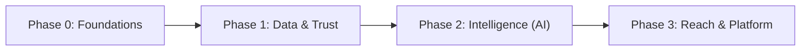

# 20. Future Roadmap

Enterprise recommendations, sequenced by dependency and impact. Each item notes the enabling work
already present in the codebase.

## 20.1 Sequencing overview

## 20.2 Phase 0 — Foundations (harden what exists)

| Item | Why | Enabler |
|------|-----|---------|
| **Reconcile SQL schema drift** | Single source of truth before scaling | `database.md` §18.7 |
| **Verify/enable RLS on all tables** (esp. `chat_messages`) | Data safety | `security.md` §17.6 |
| **Server-auth tutor/parent portals** | Consistent perimeter | mirror `admin/layout` |
| **In-handler auth on admin API** | Defence in depth | `authorizeAdmin` reusable |
| **Fix Qaida debt items** (`rate_screen`, `perfect-game`, unified reward engine, cert routing) | Correctness | pure functions exist |

## 20.3 Phase 1 — Data & Trust

| Item | Why | Enabler |
|------|-----|---------|
| **Persist Qaida progress to Supabase** | Cross-device continuity; real analytics | `QaidaProgress` model + adapters (`progressAdapters.ts`) |
| **Real Teacher LMS analytics** | Replace placeholder `TutorDashboard` | `createTutorProgressSnapshot()` hook point |
| **Parent Analytics** | Cross-device child insights | `createParentProgressSnapshot()` |
| **Recorded Qari audio** | Authentic pronunciation | manifest + `QaidaAudioService` already support URLs |
| **Payments** | Automate fees | `fees` model in place |
| **CRM / lifecycle automation** | Trial → enrol → retention | `trial_status`, sources exist |

## 20.4 Phase 2 — Intelligence (AI)

| Item | Description | Enabler |
|------|-------------|---------|
| **AI Pronunciation scoring** | Score child recitation vs. target | `voice-tracker` prototype + audio hooks |
| **AI Assessment** | Auto-grade recitation/reading | assessment model + attempts history |
| **AI Reports** | Draft progress reports from audio + roadmap | report form + audio notes in Storage |
| **AI Teacher / tutor copilot** | Suggest next lesson, flag struggles | curriculum + progress data |
| **AI SEO/content assist** (public site) | Maintain topical authority | public repo |

## 20.5 Phase 3 — Reach & Platform

| Item | Description |
|------|-------------|
| **Offline PWA** | Installable, offline lessons/practice (LMS is client-side already) |
| **Mobile apps** | Native wrappers around the learner experience |
| **Live classes** | Integrated video (currently external meeting links) |
| **Multi-language UI** | Beyond English/Arabic content |
| **CMS** | Author curriculum/lessons without code (replace static `modules.ts`) |
| **Multi-tenant** | Franchise/partner academies |
| **Leaderboards & social** | Motivation at scale (guard child-safety) |

## 20.6 Prioritised backlog (top 10)

1. 🔴 Reconcile schema + enable RLS everywhere.
2. 🔴 Persist Qaida progress to Supabase.
3. 🟠 Server-auth tutor/parent + admin API in-handler checks.
4. 🟠 Real teacher/parent Qaida analytics.
5. 🟠 Recorded Qari audio pipeline.
6. 🟡 Unify game reward logic; fix badge/cert/rate_screen debt.
7. 🟡 Payments integration.
8. 🟡 PWA/offline for learners.
9. 🟡 CMS-authored curriculum.
10. 🟢 AI pronunciation/assessment/report copilots.

## 20.7 Guiding principles

- **Child safety & privacy first** — minimise PII on learner surfaces; audit any social features.
- **Progress model is the spine** — most analytics/AI features depend on persisting `QaidaProgress`.
- **Keep the feature slice clean** — extend via the existing state/adapters, not ad-hoc coupling.

> Related: [feature-inventory.md](./feature-inventory.md) · [code-quality.md](./code-quality.md) ·
> [scorecard.md](./scorecard.md)
