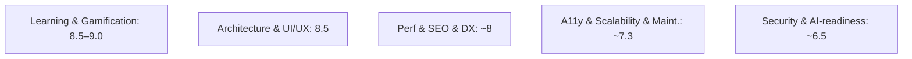

# 23. Final Enterprise Scorecard

Scores are out of 10, based on the code as it exists today (not aspirational). Justifications reference
the relevant chapters.

## 23.1 Scores

| # | Category | Score | Justification |
|---|----------|:-----:|---------------|
| 1 | **Architecture** | 8.5 | Clean feature-based App Router; isolated LMS slice; single orchestrator; sensible rendering split. Minor: asymmetric auth, dual curriculum IDs. |
| 2 | **UI** | 8.5 | Polished, brand-consistent design systems (portal + Qaida), mascots, thoughtful visuals. |
| 3 | **UX** | 8.5 | Delightful gamified learning loop; free exploration; parent/teacher visibility. Minor navigation naming quirks. |
| 4 | **Performance** | 7.5 | Aggressive lazy loading, motion budget, SVG/canvas over images. No data cache; unverified bundle. |
| 5 | **SEO** | 8.0 | Correct `noindex` for a private app; strong public bridge via `/qaida-preview`. (Public site carries the schema.) |
| 6 | **Accessibility** | 7.0 | Strong Qaida a11y (skip links, live regions, tracing bypass, reduced motion). Games need keyboard parity; portals need audit. |
| 7 | **Security** | 6.5 | Solid admin perimeter + RLS reliance. Non-HttpOnly cookies, client-only tutor/parent gates, service-role APIs trust middleware, RLS coverage unverified. |
| 8 | **Scalability** | 7.0 | LMS cleanly extensible; blocked by device-local progress + schema drift until reconciled. |
| 9 | **Maintainability** | 7.5 | Strong typing, pure logic, contract tests; held back by duplication + dead code + drift. |
| 10 | **Developer Experience** | 8.0 | Clear structure, `@/*` alias, strict TS, contract tests, readable code. No portal/E2E tests. |
| 11 | **Gamification** | 9.0 | XP/coins/levels/streaks/16 badges/certificate/7 games/celebrations — excellent depth. |
| 12 | **Educational Design** | 8.5 | Coherent 11-module progression, multi-sensory (see/hear/trace/play), teacher/parent notes, Makharij. Audio is TTS pending Qari recordings. |
| 13 | **Business Readiness** | 8.0 | Full ops suite (students, sessions, fees, earnings, reports, analytics) + conversion demo. Payments/CRM still manual. |
| 14 | **AI Readiness** | 6.5 | Clear hook points (voice tracker, audio, assessment, reports) but no AI wired yet; needs persisted data first. |
| 15 | **Enterprise Readiness** | 7.0 | Production-capable ops + LMS; gated on data persistence, schema reconciliation, auth hardening, testing depth. |

## 23.2 Weighted overall

| Weighting lens | Result |
|----------------|--------|
| Simple average | **7.7 / 10** |
| Product/learning-weighted (UX, gamification, education heavy) | **~8.2 / 10** |
| Enterprise-hardening-weighted (security, scalability, testing heavy) | **~7.2 / 10** |

**Headline: ~7.7/10 — a strong, well-architected product with an exceptional learning experience,
ready for enterprise once data persistence, schema reconciliation, auth hardening and test depth are
addressed.**

## 23.3 Radar snapshot

## 23.4 Top 5 levers to raise the score

1. **Persist Qaida progress to Supabase** → Scalability, AI readiness, Parent/Teacher value.
2. **Reconcile schema + enable RLS everywhere** → Security, Scalability, Maintainability.
3. **Harden tutor/parent + API auth** → Security, Enterprise readiness.
4. **Add E2E + RLS + portal tests** → Maintainability, DX, Enterprise readiness.
5. **Ship recorded Qari audio + keyboard game parity** → Educational design, Accessibility.

> Related: [code-quality.md](./code-quality.md) · [roadmap.md](./roadmap.md) · [security.md](./security.md)
