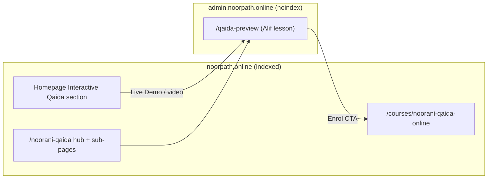

# 13. SEO Architecture

The admin platform is a **private application**, so its own pages are intentionally **not indexed**.
SEO value flows through the **public marketing site** (`noorpath.online`), which links into this app's
one public surface: `/qaida-preview`. This chapter documents both the admin-side SEO posture and how it
participates in the wider NoorPath topical-authority strategy.

## 13.1 Indexing posture (admin app)

| Surface | Robots | Reason |
|---------|--------|--------|
| `/admin/*`, `/tutor/*`, `/parent/*` | Behind auth | Private ops data |
| `/admin/noorani-qaida`, `/parent/qaida`, `/tutor/qaida` | `robots: noindex` | Authenticated tools |
| `/qaida-preview` | `robots: noindex`, `force-static` | Conversion surface, not an indexable page |
| Root layout metadata | title/description/favicon | Admin identity only |

The admin app deliberately keeps everything out of the index — correct for a back-office system. There
is **no sitemap, robots.txt strategy, canonical, OpenGraph or Twitter card system** here by design;
those live on the public marketing site.

## 13.2 Metadata

- Root `layout.tsx` sets `title: "NoorPath Academy — Admin Panel"`, a description, and `/favicon.svg`.
- The three Qaida entry pages export `metadata` with descriptive titles + `robots: noindex`
  (e.g. preview: *"Interactive Noorani Qaida — Free Preview | NoorPath"*).

## 13.3 The public bridge (where SEO actually happens)

- The public site owns the entity graph (EducationalApplication, Course, FAQPage, Breadcrumb,
  Organization) and the keyword clusters (Interactive/Online/Digital Noorani Qaida, Arabic alphabet,
  phonics, Makharij, kids Quran learning, geo terms UK/USA/Canada/Australia).
- The admin `/qaida-preview` is the **product proof** that the marketing pages point to — improving
  engagement signals (dwell time, interaction) that indirectly support the public pages.
- The enrol CTA closes the loop back to the indexed course page, aiding conversion attribution.

## 13.4 Entity & topical authority (public, referenced here for completeness)

NoorPath's SEO strategy positions the interactive Qaida as differentiated from static "Noorani Qaida
PDF" content. The admin preview substantiates the claims (audio, tracing, games, progress) that the
public schema and copy assert. Machine-readable schema on the public site + a working interactive demo
here creates a credible **product ↔ content** pairing that search and AI answer engines can verify.

## 13.5 AI / LLM discoverability

- The admin app is not intended for LLM crawling.
- The **public** site carries the structured content and (per the public repo) an LLM-friendly content
  layer; the admin preview simply needs to remain reachable, fast, and `noindex`.

## 13.6 Recommendations

| Area | Recommendation |
|------|----------------|
| Preview attribution | Keep query-param attribution (`source=website`) if re-introduced, for analytics |
| Robots consistency | Ensure `/qaida-preview` stays `noindex` and is excluded from any future admin sitemap |
| Structured data | Keep all schema on the public site; do not add indexable schema to the admin app |
| Performance | Preview speed affects engagement signals on the linking public pages — keep it fast (see [performance.md](./performance.md)) |

> Related: [performance.md](./performance.md) · [noorani-qaida.md](./noorani-qaida.md)
