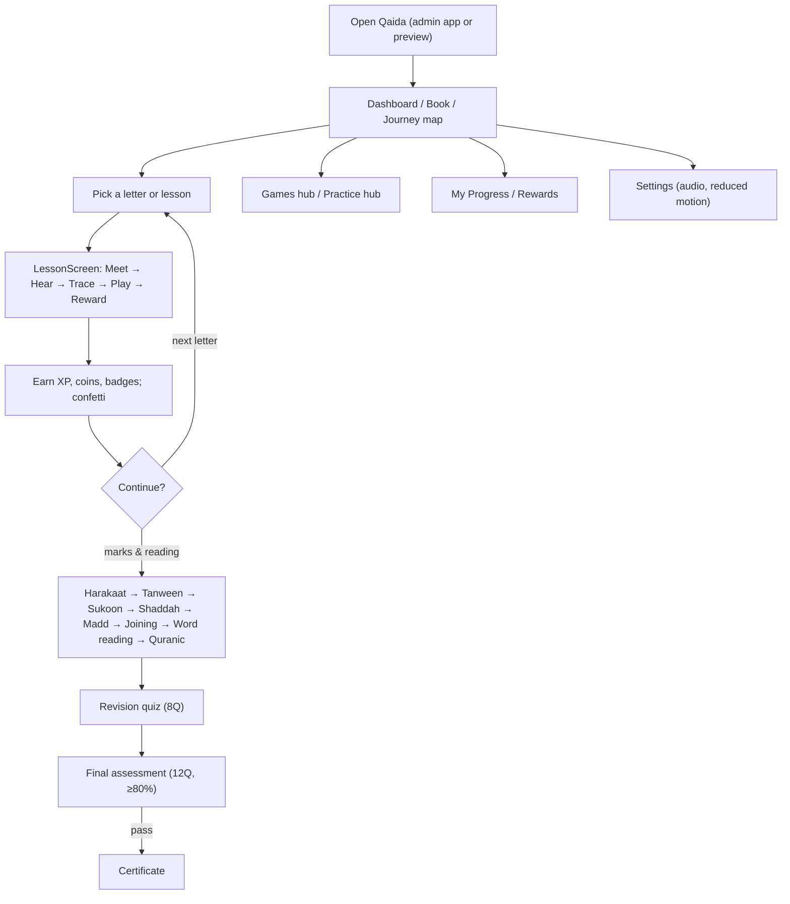

# 12. Student Experience

The student (child, ages 3–12) experiences NoorPath primarily through the **Interactive Noorani Qaida**.
There is **no separate student login** — the learner experience is device-local (progress in
`localStorage`) and is reached either inside the admin app (`/admin/noorani-qaida`) or via the public
`/qaida-preview`. Live human teaching happens in 1:1 sessions managed through the tutor portal.

## 12.1 Complete journey

## 12.2 Login (or lack thereof)

No child credentials. The engine hydrates progress from the browser and greets the learner (default
name "Ali Raza"; "Guest" in public preview). This lowers friction for young children and keeps PII out
of the learner surface.

## 12.3 Dashboard

The Qaida dashboard (inside `QaidaShell`) presents progress, quick access to the book, journey map,
games and practice, with the persistent **`QaidaHUD`** showing level, XP, coins and streak.

## 12.4 Qaida & lessons

- **Book** (`NooraniBook`/`CurriculumBook`/`QaidaEbook`) — browse all 28 letters and 11 modules.
- **Journey map** — visual alphabet progress across 4 letter families.
- **Letter lesson** (`LessonScreen`) — staged flow (Meet/Hear/Trace/Play/Reward) with mascot guidance.
- **Topic lesson** (`TopicLessonScreen`) — marks, Madd, joining, reading, Quranic, revision, assessment.

## 12.5 Practice & games

`PracticeHub` offers letter-focused drills (trace/write/listen/pronounce) and configurable games via
`practiceConfig` (auto = all 7, or a custom subset chosen by a teacher). `GamesHub` is the global games
catalog. See [games.md](./games.md).

## 12.6 Rewards & progress

Completing screens and games earns XP, coins and badges; levels rise every 300 XP; streaks reward daily
study. `ProgressScreen` shows overall curriculum %, per-module progress, stat tiles and the full badge
grid with earn dates. See [noorani-qaida.md](./noorani-qaida.md) §5.12.

## 12.7 Certificates

After passing the final assessment (≥80%), the learner unlocks the ornamental **certificate** — a
celebratory, teacher-verification-aware completion artifact.

## 12.8 Logout

Not applicable to the child surface (no session). Adults log out via the portal `Sidebar`.

## 12.9 Learning-flow principles

- **Multi-sensory:** see (letter/forms), hear (audio/TTS), do (trace), play (games).
- **Encouragement over gating:** all content is explorable; progress motivates rather than blocks.
- **Calm pacing:** mascots, gentle feedback, reduced-motion respect for sensory-sensitive learners.
- **Bridge to live teaching:** self-paced practice precedes tutor correction (the Teach→Practise→Review
  loop in [overview.md](./overview.md)).

## 12.10 Public visitor variant

Website visitors experience a **constrained** version at `/qaida-preview`: only the Alif lesson is
unlocked, other navigation triggers an **enrol prompt**, and a banner links to enrolment. This is the
top-of-funnel conversion surface (see [flowcharts.md](./flowcharts.md)).

> Related: [noorani-qaida.md](./noorani-qaida.md) · [games.md](./games.md) · [parent.md](./parent.md)
