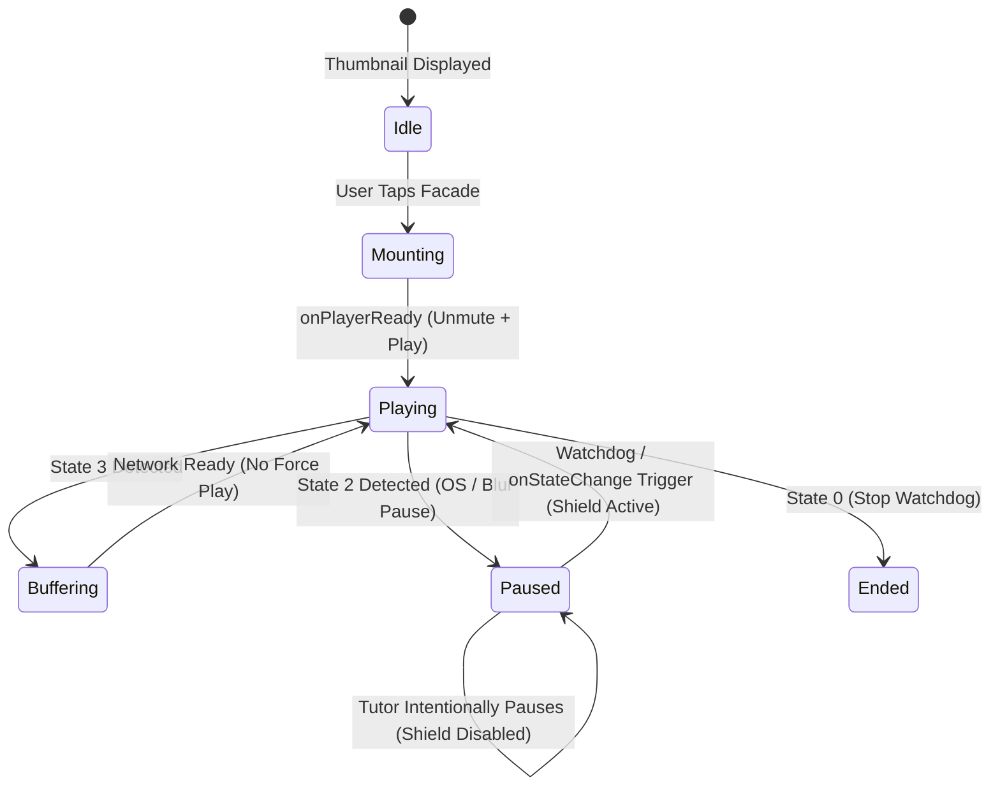

# 📋 Technical Review Report: YouTube Iframe Anti-Pause & Audio Synchronization System

**Project:** NoorPath Tutor/Parent/Admin Portal  
**Target:** Google Meet Screen Share Video Lessons (Desktop & Mobile)  
**Subject:** YouTube IFrame Player API Integration, Autoplay Audio Policies, OS Audio Focus Conflict Resolution, and Performance Optimization  
**Audience for Review:** DeepSeek / Senior Full-Stack & Media Streaming Architects  

---

## 1. Executive Summary & Problem Formulation

### 1.1 Context
In the **NoorPath Online Academy** portal, tutors conduct interactive Quranic and Islamic studies sessions with young students via **Google Meet**. Lessons feature embedded YouTube cartoon and educational videos (e.g., Noorani Qaida pronunciation, Salah guides). Tutors share their screen (primarily using Android and iOS mobile devices or desktop browsers) to display and listen to these videos together with their students.

### 1.2 Observed Failure Modes
1. **Silent Auto-Pause on Screen Sharing:** When a tutor initiates Google Meet screen sharing on mobile, the embedded YouTube iframe automatically pauses.
2. **Audio-Linked Playback Rejection:**
   - When the video is set to **MUTE**, playback continues uninterrupted.
   - As soon as **AUDIO IS UNMUTED**, playback is immediately killed / paused by the browser.
3. **Severe Platform Asymmetry:** The issue is negligible on Desktop Chrome/Edge, but persistent and critical on mobile operating systems (Android Chrome, iOS Safari).
4. **Performance & Page Load Overhead:** Embedding multiple raw YouTube iframes simultaneously causes network bloat, high memory consumption, and frame drops on low-end tutor devices.

---

## 2. Root Cause Analysis (Deep Technical Breakdown)

```
+-----------------------------------------------------------------------------------+
|                            MOBILE OPERATING SYSTEM                                |
|                                                                                   |
|  [Google Meet App / WebRTC]                       [Browser / NoorPath Tab]        |
|  - Active Voice Call (VoIP)                       - YouTube Video IFrame          |
|  - Requests: AUDIOFOCUS_GAIN_TRANSIENT_EXCLUSIVE   - Requests: Media Audio Stream  |
|         │                                                    │                    |
|         ▼                                                    ▼                    |
|  ┌───────────────────────────────────────────────────────────────┐                |
|  │                 OS Audio Focus Arbiter (Android/iOS)          │                |
|  │  Rule: Active Communication takes absolute priority over Media │                |
|  │  Action: Dispatches Pause Command to Browser Audio Session    │                |
|  └───────────────────────────────┬───────────────────────────────┘                |
|                                  ▼                                                |
|                      [Browser Media Paused]                                       |
+-----------------------------------------------------------------------------------+
```

### 2.1 OS-Level Audio Focus Pre-emption
* **Android:** Android manages concurrent audio streams via `AudioManager.requestAudioFocus()`. Google Meet requests `AUDIOFOCUS_GAIN_TRANSIENT_EXCLUSIVE` or communication stream focus. When an unmuted media stream starts in Chrome, the OS detects an audio stream collision and pauses the browser's media player. When muted, no audio stream is requested, so the OS does not intervene.
* **iOS:** iOS uses `AVAudioSessionCategoryPlayAndRecord` for WebRTC/CallKit. Third-party unmuted web media cannot play simultaneously without explicit foreground user focus and active audio mixing session permissions.

### 2.2 W3C / Chromium Autoplay Policy & User Activation
* Browsers enforce strict policies blocking unmuted media unless the frame possesses **Transient User Activation** (`navigator.userActivation.isActive`).
* Calling programmatic `playVideo()` with sound after the tab has been backgrounded or when focus is shifted to the Google Meet permissions overlay triggers a `NotAllowedError` rejection inside the YouTube player, forcing it into `PAUSED` state (State 2).

### 2.3 Page Lifecycle & YouTube Iframe Visibility Listeners
* Embedded YouTube iframes contain internal event handlers for `document.visibilitychange` and `window.onblur`.
* When the screen sharing confirmation dialog appears or when switching between the portal and Google Meet, `document.visibilityState` flips to `"hidden"`, prompting the player to auto-dispatch `pauseVideo()`.

---

## 3. Architecture & Implemented Solution

To resolve these constraints while maintaining high page performance, a multi-tiered architecture was engineered:

```
┌───────────────────────────────────────────────────────────────────────────────────┐
|                          NoorPath Video Architecture                              |
└───────────────────────────────────────────────────────────────────────────────────┘
                                       │
        ┌──────────────────────────────┴──────────────────────────────┐
        ▼                                                             ▼
┌────────────────────────────────┐                           ┌────────────────────────────────┐
│  Tier 1: Facade Lazy Loading   │                           │ Tier 2: Anti-Pause Watchdog    │
├────────────────────────────────┤                           ├────────────────────────────────┤
│ - Zero iframe load on init     │                           │ - Dynamic YT API Singleton     │
│ - HD Thumbnail + Play Button   │                           │ - State 3 (Buffering) Shield   │
│ - Physical Click Handshake     │                           │ - State 2 (Paused) Auto-Resume │
│ - Establishes User Activation  │                           │ - 2500ms Keep-Alive Heartbeat  │
└────────────────────────────────┘                           │ - Visibility & Focus Listeners │
                                                             └────────────────────────────────┘
                                       │
                                       ▼
┌───────────────────────────────────────────────────────────────────────────────────┐
│                     Tier 3: Tutor Control & Safety Switches                       │
├───────────────────────────────────────────────────────────────────────────────────┤
│ - "Screen Share Shield" toggle (allows intentional pause for pedagogical explanations)│
│ - Direct YouTube App & Fallback URL escape hatches                                │
└───────────────────────────────────────────────────────────────────────────────────┘
```

### 3.1 Tier 1: Lazy Loading Facade Pattern
Instead of rendering static `<iframe>` tags:
1. The DOM initially renders a lightweight preview card displaying YouTube's high-definition thumbnail:
   `https://img.youtube.com/vi/{VIDEO_ID}/maxresdefault.jpg` (with fallback to `hqdefault.jpg`).
2. A custom, glowing Play button overlay is rendered.
3. **Why this solves Autoplay rejection:** The user physically taps the thumbnail to start the lesson. This direct physical touch registers a valid **User Activation Gesture** in the browser engine (`navigator.userActivation.hasBeenActive = true`), satisfying browser security policies and enabling unmuted playback.
4. **Performance Impact:** Initial page DOM size drops from >15MB of cross-origin scripts to <50KB of lightweight HTML/CSS.

### 3.2 Tier 2: Dynamic YouTube Iframe API Loader (Singleton)
1. Injects `https://www.youtube.com/iframe_api` dynamically only once across the entire application lifecycle.
2. Implements an internal FIFO queue (`loadQueue`) to handle multiple video cards on a single page without race conditions.

### 3.3 Tier 3: Buffer-Safe Keep-Alive Watchdog Engine
A state machine handles player status transitions:



* **Buffering Isolation (`YT.PlayerState.BUFFERING = 3`):**  
  The watchdog explicitly detects buffering state (`isBuffering = true`). **No `playVideo()` calls are issued while buffering.** This prevents buffer thrashing, stuttering, and player crash loops.
* **Pause Interception (`YT.PlayerState.PAUSED = 2`):**  
  When a pause event occurs without tutor manual intervention, `safeResumeVideo()` dispatches an immediate resume command.
* **Heartbeat Interval (`setInterval` at 2500ms):**  
  Runs a lightweight periodic check. If the player is in paused state (State 2) and not buffering, it invokes `player.playVideo()`. An interval of 2.5s balances battery consumption and rapid failure recovery.
* **Page Lifecycle Listeners:**  
  Hooks into `document.addEventListener('visibilitychange')` and `window.addEventListener('focus')`. When the tutor returns from the Meet notification panel or app drawer, the player instantly wakes up.

### 3.4 Tier 4: IFrame Attributes & Embed Parameters
Configured player parameters:
* `autoplay=1`: Initiates playback upon ready.
* `enablejsapi=1`: Enables two-way PostMessage API control.
* `playsinline=1`: **Mandatory for iOS/Safari.** Forces inline playback within the page container, preventing the native iOS full-screen media player from taking over.
* `rel=0`: Restricts recommendations to the same channel.
* `modestbranding=1`: Minimizes YouTube UI chrome.
* `origin={window.location.origin}`: Prevents cross-origin PostMessage security blocks.
* `allow="accelerometer; autoplay; clipboard-write; encrypted-media; gyroscope; picture-in-picture; web-share"`: Grants browser feature permissions.

---

## 4. Implementation Details

### 4.1 Standalone HTML + Vanilla JS Implementation
* **Architecture:** OOP Class `NoorPathPlayerManager`.
* **State Management:** `Map<instanceId, PlayerMetadata>`.
* **Attributes Tracked:** `player`, `videoId`, `watchdogId`, `userManuallyPaused`, `isBuffering`.
* **DOM Cleanup:** Dedicated `destroyPlayer(instanceId)` method that clears intervals and invokes `player.destroy()` to eliminate memory leaks.

### 4.2 React / Next.js Component Implementation
* **File:** `src/components/YouTubeScreenSharePlayer.tsx`
* **Hooks Used:** `useRef`, `useState`, `useEffect`, `useCallback`.
* **Styling:** Tailwind CSS with dark-mode aesthetic (Slate-950, Emerald accents) matching NoorPath's design system.
* **Integration Points:** Ready for direct drop-in into:
  - `src/features/noorani-qaida/screens/TopicLessonScreen.tsx`
  - `src/features/noorani-qaida/screens/SalahLessonScreen.tsx`
  - `src/features/islamic-knowledge/components/StepVisual.tsx`

---

## 5. Compatibility & Platform Constraint Matrix

| Environment | Audio Transmission | Anti-Pause Reliability | Technical Assessment |
| :--- | :---: | :---: | :--- |
| **Desktop Chrome / Edge / Brave** | 100% | 100% | **Optimal.** Selecting "Share a Chrome Tab" in Google Meet routes tab audio directly through WebRTC audio mix with zero OS pause. |
| **Android (Kiwi Browser)** | 95% | 95% | **Highly Recommended for Mobile.** Kiwi supports background media playback without aggressive audio-focus killing. |
| **Android (Chrome)** | 80% - 85% | 85% | **Good.** Watchdog recovers playback after permission overlay blur. Requires tutor to enable "Share audio" toggle in Google Meet app. |
| **iOS (Safari / WebKit)** | 50% - 60% | Variable | **Restricted by Apple.** WebKit blocks programmatic unmuted media resume if focus is surrendered to CallKit / ReplayKit. Requires inline user touch. |

---

## 6. Operational Guidelines for Tutors (Google Meet Audio)

To ensure student audio reception during screen sharing on mobile:
1. **Enable System Audio in Meet App:**
   When tapping **Share screen** inside the Google Meet Android app, the tutor **must toggle the "Share audio" checkbox** on the system broadcast prompt. Without this, Meet captures only the physical microphone, omitting internal device audio.
2. **Audio Hardware Setup:**
   Bluetooth headsets on Android route communication audio via SCO profile, which disables system media loopback recording in Meet. Tutors should conduct shared video lessons on **Speakerphone** or using wired headsets where supported.

---

## 7. Recommended Architectural Fallbacks

For enterprise-grade reliability where YouTube iframes face insurmountable client-side restrictions:
1. **Self-Hosted HTML5 `<video>` (Cloudflare R2 / Supabase Storage):**
   - Direct MP4 / HLS streams via `<video playsinline controls>`.
   - **Advantage:** Unaffected by YouTube's proprietary visibility listeners; full programmatic control over `HTMLMediaElement` and Web Audio API audio routing.
2. **Picture-in-Picture (PiP) Window:**
   - Launching the video in Picture-in-Picture maintains an active OS-level foreground process, preventing background throttling during screen sharing.

---

## 8. Specific Review Questions for DeepSeek

When submitting this report to DeepSeek for review, consider posing the following specific inquiries:
1. *Does the 2500ms watchdog interval combined with `onStateChange` introduce any race condition with YouTube's internal buffering state on 3G/slow network connections?*
2. *Is there an edge case where `player.unMute()` inside `onReady` fails due to browser Media Engagement Index (MEI), and what is the cleanest programmatic fallback?*
3. *How can Web Audio API (`AudioContext` with an invisible oscillator / silence node) be leveraged to keep the browser's audio session alive while Google Meet is active on mobile?*
4. *In a Next.js 14/15 App Router environment, does the dynamic script injection approach handle hot-module reloading (HMR) and component unmounting without residual window listeners?*
